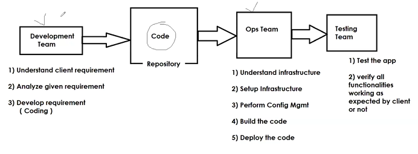
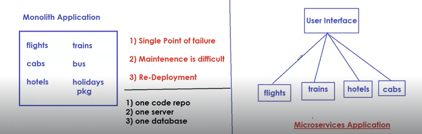
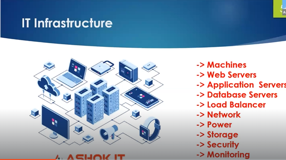
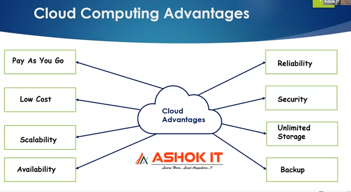
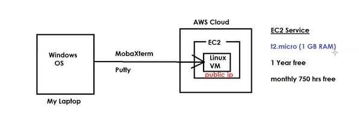

## Different Teams

__Business Team__ : It is responsible to gather the requirements from the client & provide requirements to the development team .

__Development Team__ :  Dev team is responsible to develop the project (Coding) and store the project code in source code repository (Github / BitBucket)

__Operations Team__:  Operations team is responsible to set up the infrastructure + perform the configuration management , build the code and deploy the code and after the testing the delivery of the application is also done by the ops team .

__Testing Team__ : Testing team is responsible to check the application behavior is working as expected by the Client .

## What is Devops ?

1. It is not a Tool /Technology

2. Development team will develop the code and push the code to source code repository (Git) and after that Operations team is responsible to setup the infrastructure and perform the configuration mangement , build the code and deploy the code .

3. It is a culture which is used to establish the collabaration between Development team and operations team . It's a continous process .

## Devops Tools 

* __Terraform__ :  To automate the Infrastructure creation in the cloud (Computers/Machines , servers , DBs, storage , backup , security, network etc.)

* __Ansible__ :  To perform Configuration Management like installing Java in all the machines , copy files from one machine to another .

  > Terraform is used to create the machines in the Cloud . Once the machines are created in the cloud ,Ansible will install the software's which are required in all those machines .

* __Github/Bitbucket__ :  Source Code repository server 

* __Maven / Gradle/NPM__  : The code which we take from the source code repositories is not in executable format .The purpose of these build tools to make the code executable .(Convert code to executable format )

* __SonarQube__ : Code Review Software (To identify the developer mistakes)

* __Nexus / Jfrog__ : Artifactory Servers (To store/maintain shared libraries)

* __Tomcat/IIS__ : It is a web server to run web applications .

* __Jenkins__ : It is used for CI & CD (To automate the build & deployment)

* __Docker__ : Used for Containerization (Container Creation )

* __Kubernetes__ : Used for Orchestration (To manage the Containers)
 
* __Grafana & Prometheus__ : For Monitoring Purpose

* __EFK (ElasticSearch + FileBeat + Kibana)__ : For application logs monitoring . 

## Software Application Types 

1. __Monolithic Application__ : Developing all functionalities in one single application 

2. __Microservices Application__ : Every functionality will be developed as a single project so that the maintainability will be easy

> The resources which are required to any business are considered as __Infrastructure__ and below is the image of IT infrastructure .

## On-Premises Infrastructure vs Cloud Infrastructure

__On-Premises Infrastructure__ : Some Companies will purchase and setup the Infrastructure [Machines , Webservers , Database Servers , Load Balancers etc] that is called On-Premises Infrastructure . If we setup On-Prem infrastructure then we have to purchase ,setup and manage everything required for the project .

>  Increasing or decreasing the infrastructure is difficult when we go with the On-Premises Infrastructure 

__Cloud Infrastructure__ : There are many cloud providers in the market which manages the infrastructure of the organisation by charging some amount of money .(AWS , Azure , GCP)

## What is Cloud Computing ?

Cloud computing is the process of delivering IT resources over the Internet on demand .
 
Cloud providers available in the market to provide IT infrastructure based on “Pay-as-you-go” Model .

## Linux Machine Setup :

There are two ways from which we can access the Linux OS in our machine . 

1) Install Linux OS directly in our Machine

2) Create Virtual Machine in Cloud Platform (AWS) via ec2 instance 

> __Putty/MobaXterm__ is a client software to connect with Linux .

