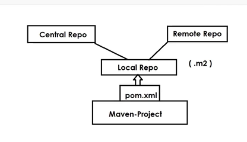

## Maven Build Tool 

__Standalone Appications:__ The applications which runs in only one computer and only one user can access [Calculator , Notepad etc. ] 

__Web Applications:__ Multiple users can access this web application at a time [Facebook , Gmail , Google meet etc. ] 

## Java Project Execution Flow :

* Java is a programming language developed by Sun Microsystems  

<mark>__NOTE : Java is under license of Oracle.__  

* Using Java we can develop software projects  

* Developers will write the source code (.java files) 

* We need to convert the source code to the byte code (.class files) 

    * __<mark>.java files ------------------------> .class files__ 

* We need to package .class files as __JAR /WAR__

## What is Project Build Process ?

* <mark>__Dependency__</mark> : Dependency nothing but a "framework/library" that is required for our project development __[Junit , Spring , Hibernate , Kafka , Redis]__

__Actual Project Build Process:__ 

* Download Required Dependencies __[Ex : Spring , Hibernate , Junit]__ 

* Add dependencies to __project build path__ (Build path setup) 

* Compile project source code  

* Execute the Unit Test cases __(JUNIT)__

* Package project as __jar file / war file.__  

__NOTE:__  Instead of doing manual build process we can automate it using __Build Tools.__

## What is Build Tool ? 

 * Build Tools are used to automate __project build process.__ 
 
 * We have several build tools in the market __[Ant , Maven , Gradle , MS-Build etc]__

 

## What is Maven ? 

* It is a build tool which is used to automate project build process . 

* Maven is free and open source software developed by Apache organization  

* Maven is developed by Java Programming language  

* Maven is only used for java projects build automation . 

__NOTE :__ To use Maven , Java software is mandatory . 


## Maven Installation in Windows :

* __Download and install Java software.__ 
 
   * Link To Download Java : https://www.oracle.com/in/java/technologies/downloads/#jdk17-windows 
 
* Set __JAVA_HOME__ in Environment Variables (System Env Variables) 

          JAVA_HOME = `<path-upto-jdk-directory>`

 
  * __User Environment Variables:__ Specific to particular account which logged in our PC 
  * __System Envrionment Variables:__ For All Accounts 

 ___NOTE:__  Environment Variables will be used by operating system 

* __Set Path for JAVA__ (Go to edit System Env Variables -> Env Variables -> System Variables -> Select Path and Click on Edit then add JDK path like below up to bin directory) 

        Path = <upto-bin-directory> 

* Verify Java installation by executing below command in "Command Prompt" 
 

   > __java -version__ 

__NOTE:__ It should display java version which we have installed 

* __Download Maven software from Apache website__
 
   * Link To download Maven : https://maven.apache.org/download.cgi 
   
   * __File Name :__ apache-maven-3.9.0-bin.zip (Binary Archive) 

* __Extract Maven Zip file__ -> Copy extracted maven folder and paste it in "C" drive 
 
* Set __MAVEN_HOME__ in System Environment Variables 
 
      MAVEN_HOME = C:\apache-maven-3.9.0 

* __Set Path for Maven__ in System Environment Variables 
     
        Path : C:\apache-maven-3.9.0\bin 

* Open Command Prompt and verify Maven Installation using below command 
  
  > __mvn -version__ 

 

## Maven Setup in Linux : 

Amazon Linux :   

  * __$ sudo yum install maven__  

Ubuntu : 

  * __$ sudo apt install maven__ 


## Maven Terminology : 

* __Archetype :__

   * It represents project template.
   
     * Quick-Start : Stand-Alone application (JAR File)
     * Web-App : Web Application (WAR File)

* __Group ID:__ 

  * Group Id represents which company developing the project __(com.tcs, com.ibm , in.ashokit)__

* __Artifact ID:__

   * It represents the Project Name __(passport-web-app , sbi-credit-card-app , irctc-web-app )__

* __Version:__

  * It represents project release number 

     * 0.0.1-SNAPSHOT (Under Development)
     * 1.0-RELEASE (Delivered to Client) 

* __Packaging:__

  * It represents the packaging format.

    * Stand-alone App : JAR
    * Web-App : WAR

* __Pom.xml__

  * __(Project Object Model)__ , It is a Maven Configuration File . 
  * Project dependencies , we will configure in the pom.xml file 

* __Maven Goals:__ 

  *  Maven Goals are used to perform project build process __(clean , compile , test , package , install)__

* __Maven Dependencies:__


   * Maven dependencies are nothing but third party libraries we want to use in the project development.(Spring , Hibernate , Junit)

* __Maven Repositories:__

   * Maven Repositories maintain the libraries __(Central Repo, Local Repo, Remote Repo)___

## Creating stand-alone application using Maven : 

* Create one folder for maven-practise  

* Open Command prompt from that folder 
 
* Execute below command to create maven standalone project 
 
   *  __mvn archetype:generate -DgroupId=in.ashokit -DartifactId=01-Maven-App -DarchetypeArtifactId=maven-archetype-quickstart -DinteractiveMode=false__

* Once project created then verify project folder structure 
 
  * __src/main/java :__ Application source code (.java files) 

  * __src/test/java :__ Application Unit Test code (.java files) 

  * __pom.xml :__ Project Object Model (Maven configuration file) 

__NOTE :__  Go inside the project folder and execute the maven goals (Always run the goals inside the project location/ where pom.xml is present) 

 

## Maven Goals : 
 
* __mvn clean :__  to delete the 'target' folder  

* __mvn compile :__ to compile source code of the project and create the target folder  

* __mvn test :__ To execute the junit of the project  

   * <mark>__test = compile + test__
   
* __mvn package__ : to package project as jar or war and packaged file will be stored in the target folder  

   * <mark>__package = compile + test + package__  

* __mvn install :__  it will install your __jar/war__ file in the repository either local or remote. 

  * __<mark>install = compile + test + package + install__

 

 

   * __<mark> $ mvn clean package__  __[It will clean the target folder and package the application ]__

## Create web-application using Maven Build Tool : 


* __mvn archetype:generate -DarchetypeArtifactId=maven-archetype-webapp -DgroupId=in.ashokit -DartifactId=amazon_app -DinteractiveMode=false__ 

 

## Maven Dependencies : 

* The libraries that are required for project development are called dependencies  [Junit , Spring , Hibernate etc .] 

* We can find maven dependencies in __www.mvnrepository.com website__

* Add below dependency in pom.xml file and execute the maven package goal  

 
```html
<dependency> 
<groupId>org.springframework</groupId> 
<artifactId>spring-core</artifactId> 
<version>5.3.23</version> 
</dependency> 
```
__NOTE :__  When we add dependency , maven will download dependency from Maven Repository . 

 

## What is Maven Repository ? 

* Maven Repository is a place where maven dependencies will be stored /available . 

* Maven supports three types of libraries . 

  * __Central Repository__
 
  * __Remote Repository__ 
 
  * __Local Repository__ 

 

* Central repositgit story is maintaining by Apache organization 

* every company will maintain their own remote repository (Ex: Nexus, JFrog) 

* Local repository will be created in our system (Location : C://users/<uname>/.m2) 

    

*  When we add dependency in pom.xml, maven will search for that dependency in local repository. If it is available it will add to project build path. 
 
* If dependency not available in local repository then maven will connect to Central Repository or Remote Repository based on our configuration.

__NOTE:__ By default maven will connect with central repository. If we want to use remote repository then we need to configure remote repository details. 
 
__NOTE:__ Every software company will maintain their own remote repositories (Ex: Nexus / JFrog) 

## Real Time Scenarios :

__NOTE:__ <mark> Sometime dependencies come as a transitive dependency , so excluding them from your dependencies file , can cause cause issue at run time saying __ClassNotFoundException.__ 