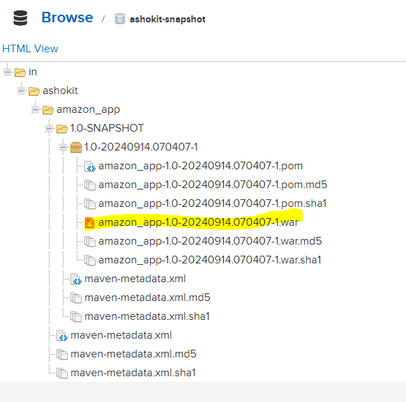
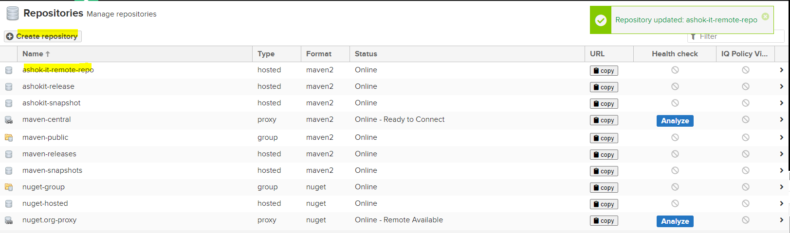

## Nexus :

* It is developed by SonaType Company.

* Nexus is called as artifactory server 
* We can store project build artifacts __[jar / war]__ in the Nexus 
* We can create Remote Repositories __[To manage the Shared Libraries]__ in Nexus .
* Nexus is developed by using Java .


   > __Java__ is mandatory to run the nexus .

__There are two reasons to create the Remote Repositories.__

* If security.jar is used in all the projects in the organization then we can place that jar in the remote repo instead of central repo because it is organization specific .

    

* If we are dependent on the central repo and if any update comes in the library . It will reflect our codebase .So its better to store the dependency at some place and it can be used in the projects .

__Q.__ What is the difference between Nexus and Github ?

* Github is a Source code Mangement software which is used to store the source code of the project

* Nexus is a Artifact Repository which is used to store build artifacts (jar/war)

## Nexus Setup :

* Take t2.medium instance in AWS EC2 service.

* Java Software is required to install Nexus 

* Connect to t2.medium instance using Mobaxterm.

## Nexus Server installation process in Amazon Linux OS .

* __Switch to Root User :__
  * $ sudo su -

* __Change the directory__
  * $ cd /opt

* __Install Java 1.8V__
  * $ sudo yum install java-1.8.0

* __Download the Nexus server__
   * $ wget https://download.sonatype.com/nexus/3/nexus-3.40.1-01-unix.tar.gz

* __Extract the downloaded tar file using tar command__
   * $ tar -zxvf  nexus-3.40.1-01-unix.tar.gz

* __Rename the nexus directory .__
   * $ mv /opt/nexus-3.40.1-01 /opt/nexus

> As a good security practise , Nexus is not advised to run nexus service as a root user , So create a new user called nexus and grant sudo access to manage the nexus services as follows .

* __Create a new user in linux VM .__
  
  * useradd nexus

> Give the sudo access to nexus user using sudoers file .

* __Execute the below command to open the sudoers file .__

   * $ visudo  [ctrl+x to save, and then press Y for "YES" and then press enter ]

* __Add below line the sudoers file (just below root user details we can add it)__
  
    * nexus ALL=(ALL) NOPASSWD: ALL

* __Change the owner and group permissions to /opt/nexus and /opt/sonatype-work directories .__

     * $ chown -R nexus:nexus /opt/nexus
     * $ chown -R nexus:nexus /opt/sonatype-work
     * $ chmod -R 775 /opt/nexus
     * $ chmod -R 775 /opt/sonatype-work

* __Open /opt/nexus/bin/nexus.rc file and uncomment run_as_user parameter and set as nexus user.__
    * $ vi /opt/nexus/bin/nexus.rc
    * run_as_user="nexus"

* __Create nexus as a service.__

   * $ ln -s /opt/nexus/bin/nexus /etc/init.d/nexus

* __Switch as nexus user and start the nexus service as follows.__

   * su - nexus

* __Enable the nexus service__

   * sudo systemctl enable nexus

* __Start the nexus service__ 

   * sudo systemctl start nexus 

* __Check the status of nexus service.__

   * sudo systemctl status nexus

> Access the Nexus server from the browser (by-default it runs on 8081 port number) , Enable this port number in the Security Group .


> Default username is : __admin__  & we can copy the __password__ by executing the  __sudo cat  /opt/sonatype-work/nexus3/admin.password__ (__username:admin , password: admin__)

>  If we have done the packaging on the java 17 version and nexus is running on java 1.8 V both are independent to each other because nexus is running on the different machine.

>  In real world scenarios , We maintain the dependencies in the remote repo and we don’t directly depend on the central repo for the dependencies due to security reasons.

## Working with the Nexus Repository 

In nexus server, we can create 2 types of repositories to store project artifacts.

  * __Snapshot Repository:__ If project is under development then that project build artifacts will be stored into snapshot repository.

  * __Release Repository:__ If project development completed and released to production then that project build artifacts will be stored to release repository.

> Based on `<version/>`name available in project pom.xml file it will decide artifacts should be stored into which repository.

  * `<version>` __0.0.1-SNAPSHOT__ `</version>` => It will go to snapshot repository

  * `<version>` __RELEASE-1.0__ `</version>` => It will go release repository.

> Login into the Nexus server by entering the credentials and create the Repositories .


   * __Snapshot-Repo URL__: http://3.111.188.4:8081/repository/ashokit-snapshot/
   * __Release-Repo URL__: http://3.111.188.4:8081/repository/ashokit-release/

## Integrate maven with the Nexus Server (Uploading the Artifacts)

 * __Step 1__: Open any Maven project and modify the pom.xml as below to include the Nexus Repository details 

     ```html
    <distributionManagement> 
        <repository>
            <id>nexus</id>
            <name>Ashok IT Releases Nexus Repo</name>
            <url>http://3.111.188.4:8081/repository/ashokit-release/</url>
        </repository>
        
        <snapshotRepository>
            <id>nexus</id>
            <name>Ashok IT Snapshots Nexus Repo</name>
            <url>http://3.111.188.4:8081/repository/ashokit-snapshot/</url>
        </snapshotRepository>	
    </distributionManagement>
    ```
* __Step 2__: Nexus Server Credentials will be configured in Maven "settings.xml" file.
     
     * __Maven Location :__ C:\apache-maven-3.8.5\conf

     * In settings.xml file, under `<servers>` tag add below `<server>` tag.
      
        ```html
        <server>
        <id>nexus</id>
        <username>admin</username>
        <password>Dhano@12345</password>
        </server>
        ```
      
> The id that we have given in __pom.xml__ , It should be same in __settings.xml__ file also.

* __Step 3__ :  Once these details are configured then we can run below maven goal to upload build artifacts to Nexus Server.

    * __$ mvn clean deploy__
    
* war file has been uploaded on the Nexus Server .

    

__NOTE__: If you change the version from __1.0-SNAPSHOT__ to __1.0-RELEASE__ in pom.xml file and again execute the __maven clean deploy goal__ then all the artifacts of the project will be uploaded to the release repository .

> The main usage to push the project build  artifacts on the Artifactory server is __"BACKUP"__

## Creation of Remote Repositories in the Artifactory Server (downloading the artifacts)

* Remote repositories are used for maintaining shared libraries (common jars required for multiple projects in the company)

* If we want to use few jars files in multiple projects in the company then we will use Remote Repository to store those jars (libraries).

* Remote repository is specific to our company projects.

* Below are the steps to configure the remote repository in the Nexus Server.

   * __Step 1__ : Create the Remote Repository in the Nexus Server and upload the JAR [Artifacts]

     

     __Remote-Repo URL__ : http://3.111.188.4:8081/repository/ashok-it-remote-repo/

     The developers will give the dependency/jar to the the Ops team and the Ops team will be responsible  to store that dependency/jar in the Nexus Server . We can upload the jar/war by using the upload component coming in __ashokit-remote-repo__

      
     
     


  __Step 2__: Take dependency details of uploaded shared library (jar file) and add it as a dependency in project pom.xml file	like below.

    ```html
        <dependency>
        <groupId>in.ashokiit</groupId>
        <artifactId>gradle-jar</artifactId>
        <version>1.0</version>
        </dependency>
    ```

  __Step 3__: We need to add Remote Repository Details in pom.xml above `<dependencies/>` tag.

    ```html
        <repositories>
            <repository>
                <id>nexus</id>
                <url>http://3.111.188.4:8081/repository/ashok-it-remote-repo</url>
            </repository>
        </repositories>
    ```

  __Step 4__:  After adding the remote repository details in pom.xml then execute maven package goal and see dependency is downloading from nexus repo or not.
  
        * mvn clean package

## How to resolve HTTP Mirror Block Issue ?

   *  Make below change in __Maven/conf/settings.xml__

```html
         <mirror>
         <id>maven-default-http-blocker</id>
         <mirrorOf>dummy</mirrorOf>
         <name>Pseudo repository to mirror external repositories  initially using HTTP.</name>
         <url>http://0.0.0.0/</url>
         <blocked>false</blocked>
         </mirror>
```  
> We can also use the __Release Repository__ to download the dependencies .

> Maven will do the dependencies resolution in the below order :  __Local Repo > Remote Repo > Central Repo .__

> __When the machine is up in the EC2 -Instance . No need to start the nexus via executing some commands . You can directly access nexus server with the help of below URL .__

                        * URL : http ://EC2-VM-IP:8081
