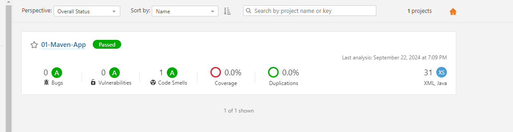
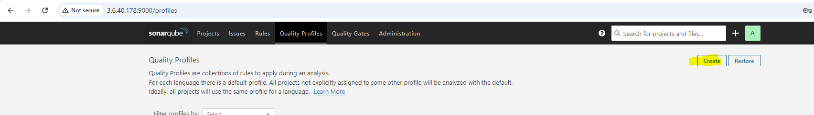
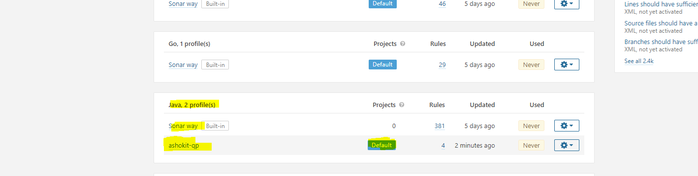
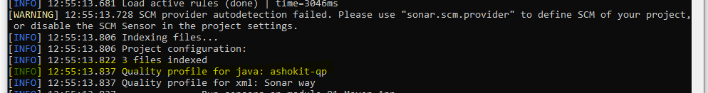
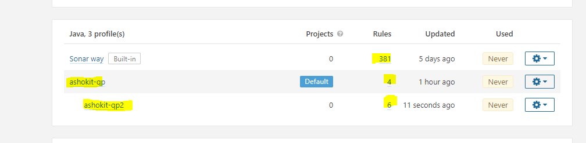
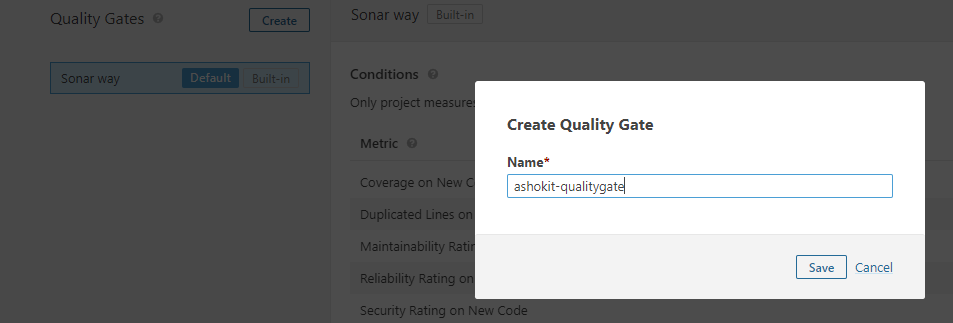
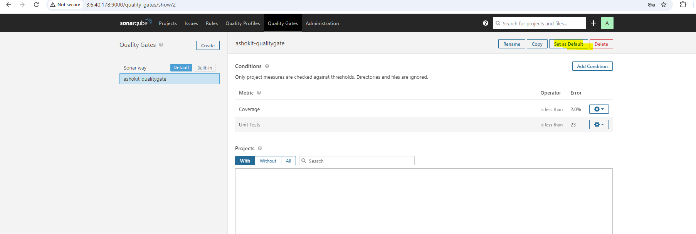
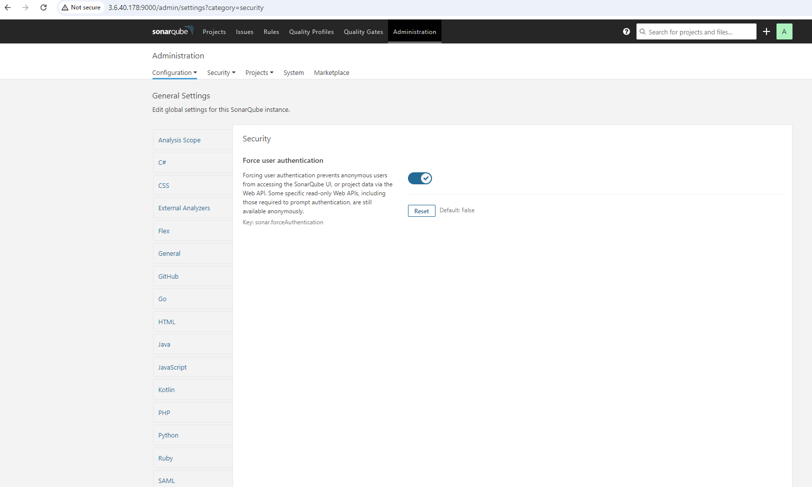

## What is SonarQube ?

 * It is Code Quality Checking Tool.

 * Using SonarQube we can perform code review to identify developers mistakes in the code

 * SonarQube s/w developed by using Java Language.

 * SonarQube supports 30+ Programming Languages to perform Code Review

 * DevOps team is responsible to generate Project Code Review Report and share it with Development team.

 ## Sonar Issues :

  * __Bugs__ : Critical Issue , we need to fix immediately 

  * __Vulnerabilities__ : Security Issues 

  * __Code Smells__ : Functionality will work , but we can make it better 

  * __Duplicate Code__ : Repeated Code 

  * __Code Coverage__ : How many lines of code is tested in unit testing.

> Every Client asks for Code Review Report . Without having the Code Review Report , Client will not accept our project .

## What is Code Coverage and Code Review ?

* __Code Coverage__ : How many lines of the code is tested by Junit test cases .
   
   * Industry Standard Code Coverage is __80%__

* __Code Review__ : Checking Coding Conventions/Bugs/Vulnerabilities/Duplicate Code etc .

> Code Review will happen before deploying our project . Code Review will not happen with the JAR / WAR . It will go to our code and check each and every line of our code , but it expects the classes to be __compiled__ that's why We do the code review part after the packaging in the form of JAR/WAR .

> If the code review is good then only we store the artifacts into the Nexus Server .

> Web Application will be packaged as WAR file . Inside our web application we can use the shared library as a JAR file .

 ## SonarQube Setup :

* Take t2.medium instance in AWS EC2 service.

* Java Software is required to install SonarQube. 

* Connect to t2.medium instance using Mobaxterm.

## SonarQube server installation process in Amazon Linux OS .

* __Switch to Root User :__
  * $ sudo su -

* __Change the directory__
  * $ cd /opt

* __Install Java 1.8V__
  * $ sudo yum install java-1.8.0

* __Download the sonar software__ .

    * wget https://binaries.sonarsource.com/Distribution/sonarqube/sonarqube-7.8.zip

* __Unzip the sonar software.__

    * unzip sonarqube-7.8.zip

> SonarQube server will not run with the root user .

* __Create a new user in linux VM .__
  
  * useradd sonar

> Give the sudo access to sonar user using sudoers file .

* __Execute the below command to open the sudoers file .__

   * $ visudo  [ctrl+x to save, and then press Y for "YES" and then press enter ]

* __Add below line the sudoers file (just below root user details we can add it)__
  
    * sonar ALL=(ALL) NOPASSWD: ALL

* __Change the owner and group permissions for sonar directory.__

     * $ chown -R sonar:sonar /opt/sonarqube-7.8/
     * $ chmod -R 775 /opt/sonarqube-7.8
 
* __Switch to sonar user__

   * $ su - sonar 

* __Go to sonar bin directory and then go to linux directory and run the sonar server .__

  * cd /opt/sonarqube-7.8/bin/linux-x86-64
  * sh sonar.sh start

* __Check the sonar status__

   * sh sonar.sh status 

* __To stop the Sonar Server__

   * sh sonar.sh stop

> Sonar Server runs on 9000 port number by default . We can change default port of sonar server in __(conf/sonar.properties)__

    * sonar.web.port=6000

* Enable Sonar port number in EC2 VM - Security Group .
  
* Access Sonar Server in browser .

     * __URL :__ http ://EC2-VM-IP:9000

* Default Credentials of Sonar user is __admin__ & __admin__

__NOTE:__ <mark>__When we shut down the EC2 machine in which Sonar Server is running , next time the IP of the machine will change & you have to login as a Sonar User to start the Sonar Server again.__</mark>

## Integrate Sonar server with Java Maven App

* Step 1 : Clone git repository : https://github.com/ashokitschool/SB-REST-H2-DB-APP

* Step 2 : Configure Sonar Server details under `<properties/>` tag in "pom.xml" file below

    ```html
        <properties>
	       <sonar.host.url>http://3.109.216.8:9000/</sonar.host.url>
	       <sonar.login>admin</sonar.login>
           <sonar.password>admin</sonar.password>
         </properties>
    
* Step 3 : Execute the maven clean package goal (because SonarQube expects the classes to be __compiled__ )

   * __mvn clean package__

* Step 4 : Then build the project using __"mvn sonar:sonar"__ goal

> As a Devops Engineer we are not responsible to fix the issues that comes in the sonar report . We are responsible to share the report with the development team to fix those issues .



## Working with the sonar token:

* In the above process we are mentioning the sonar credentials in the pom.xml file itself . Anyone can login into the sonar server , they can update the rules or __delete__ the projects also . __So its not recommended to write the credentials into the pom.xml file .__

* Without configuring __username &  password__ , We can integrate our project with the sonar server by using Sonar Token.

> Instead of username and password we can configure sonar token in the pom.xml file .

* Below are the steps to configure the sonar token .

   * Go to sonar server dashboard -> login -> click on profile -> My Account -> Security -> Generate Token 

   * Copy the token and configure that token in pom.xml file like below :

    ```html
      <properties>
	       <sonar.host.url>http://3.6.40.178:9000/</sonar.host.url>
	       <sonar.login>4b3b1cc32a6221239277756366ef26c56150e434</sonar.login>
      </properties>
    ```

  * Execute the maven clean package goal because SonarQube expects the classes to be __compiled__ )

      * __mvn clean package__

  * Then build the project using __"mvn sonar:sonar"__ goal

## Quality Profile in the SonarQube :

*  For each programming language sonar qube provided one quality profile with set of rules

* Quality Profile means set of rules to perform code review

* We can create our own quality profile based on project requirement.

    

        
			- Name : ashokit_qp
			- Language: Java
			- Parent : None

  

__Note:__ We can make our quality profile as default one then it will be applicable for all the projects which gets reviewed under this sonar server.    

> Now the __ashokit-qp__ will be used for the code reviewing , because we have set them as default .



__Note:__ If we have any common ruleset for all projects then we can create one quality profile and we can use that as parent quality profile for other projects.

> So we can create __ashokit-qp2__ also ,  in which the parent would be __ashokit-qp__ and we can add multiple rules apart from __ashoikit-qp__ in __ashokit-qp2__



*  We can configure custom quality profile to a __specific project__ using below steps

			- Click on project name
			- Go to administration
			- Click on quality profile
			- Select profile required

* __There are three things which are associated with the Quality Profile (QP) :__

  * If we have not created any QP , then by default QP will be used .

  * If we have created any QP and if we are making that QP as default , then it will be used for all the projects which we are reviewing under the Sonar Server .

  * We can use the default quality profile for some projects &  we can configure in the sonarserver to use the specific QP to a particular project as well .

> __We can create Project Specific Quality Profiles also .__

## Quality Gate :

* Quality Gate represents set of metrics to identify project quality is Passed or Failed

*  Every Project Quality Gate should be passed

* In Sonar We have default Quality Gate

* If required, we can create our own Quality Gate also





> __Now the ashok-qualitygate will be used as a default quality gate to identify the project quality .__

* __Conclusion :__

   * If project quality gate is failed then we should not accept that code for deployment.

   * If project is having Sonar issues then development team is responsible to fix those issues

   * As a DevOps engineer, we will perform Code Review and we will send Code Review report to Development team (we will send sonar server URL to development team)

__NOTE :__ For each project , there will be __1 Quality Profile__ & __1 Quality Gate.__


## Administration Section :

Enable the below check to stop view the things in the sonar report , if you are not logged in the server .




