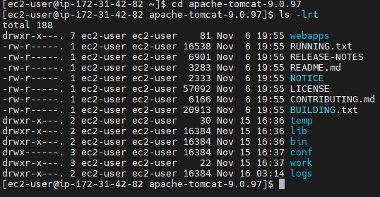
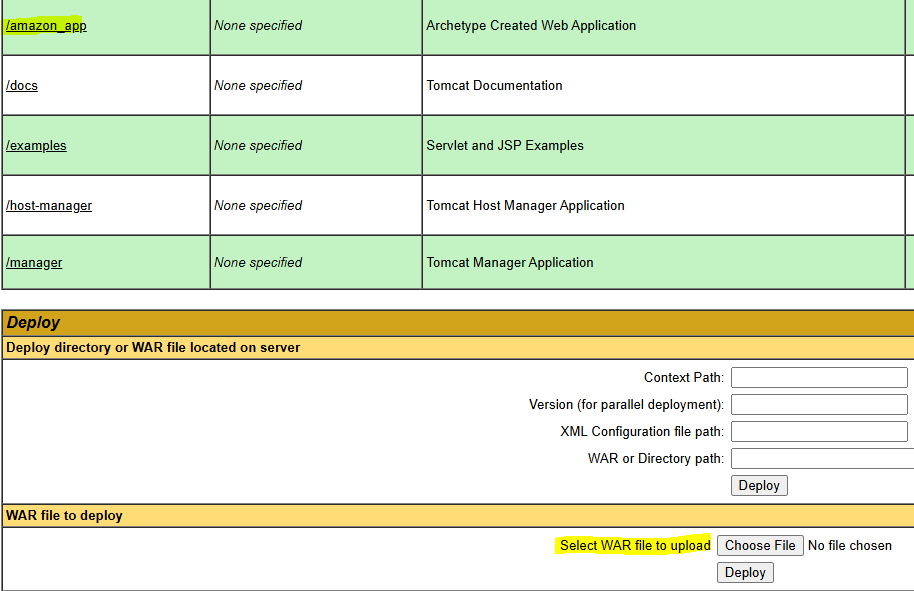
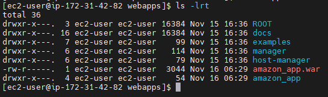

## what is Apache Tomcat ?


* It is free and open source software 

* It is called a webserver which is used to execute web applications 

* It is used to run Java web applications & handles user request and response

* Tomcat is developed by using JAVA language .

   * To run tomcat server, java should be installed.

* It runs on default port number __8080__ (We can change it in server.xml)

## Apache Tomcat directory structure :

1) __bin :__ It contains __files to start & stop server__  (windows : bat , Linux : sh)

	* windows: startup.bat & shutdown.bat
	* Linux : statup.sh & shutdown.sh

2) __conf :__ It contains tomcat __server configuration files__

	* Ex: server.xml, tomcat-users.xml etc...

3) __webapps :__ It is called as __deployment folder.We will keep war files here.__

4) __logs :__ Server log messages will be stored here

5) __lib :__ It contains libraries required for server (jars)

6) __temp :__  Temporary files will be created here (We can delete them)

## Tomcat server installation process in Amazon Linux OS .

* __Create Linux VM using Amazon Linux AMI in AWS Cloud__

* __Connect to Linux VM using mobaxterm / Putty/ Git Bash__

* __Install JAVA software using below command__ 

   * $ sudo yum install java-1.8.0

* __Verify the version of java installed in our machine.__
    
    * $ java -version

* __We can download tomcat software from its offical website__

   * __URL__ : https://tomcat.apache.org/download-90.cgi	

* __Download tomcat server tar file.__

   * 	$ wget https://dlcdn.apache.org/tomcat/tomcat-9/v9.0.100/bin/apache-tomcat-9.0.100.tar.gz


* __Extract the tar file:__

    * $ tar -xvf apache-tomcat-9.0.100.tar.gz

	
    * $ cd apache-tomcat-9.0.100
    
    * $ ls -lrt (below is the directory structure of the tomcat folder )

    

* __Go to tomcat bin directory and run tomcat server.__

   * cd bin
   * ./startup.sh

> Tomcat Server runs on 8080 port number by default . Enable this port in security group as custom TCP .

* __Access Tomcat server from your browser.__

   * URL : http://EC2-VM-Public-IP:8080/

## Enable Tomcat Admin Console access

* By default the Host Manager is only accessible from a browser running on the same machine as Tomcat. If you wish to modify this restriction, you'll need to edit the Host Manager's context.xml file.

* File Location : __tomcat-folder/webapps/manager/META-INF/context.xml__

* In context.xml file, change `<Valve>` section like below __(allow attribute value changed)__

  ```
  <Context antiResourceLocking="false" privileged="true" >
     <Valve className="org.apache.catalina.valves.RemoteAddrValve" allow=".*" />
  </Context>
   ```

* __Add Tomcat users & roles in tomcat-folder/conf/tomcat-users.xml file like below :__
 
  * two users we are configuring : first user name is __tomcat__ and second user name is __admin__

   
  ```
  <role rolename="manager-gui" />
  <role rolename="manager-script" />
  <role rolename="admin-gui" />

  <user username="tomcat" password="tomcat" roles="manager-gui" />
  <user username="admin" password="admin" roles="manager-gui,admin-gui,manager-script"/>

* Then click on __'Manager App'__ and login with credentials __(admin & admin)__ to perform deployment. Click on __/amazon_app__ to see the website content . 

  
  

* __There are two ways of deployment :__

   * Either upload the WAR file through the Tomcat admin console access 
   * OR place the war file in the webapps folder of Tomcat Directory using Mobaxterm UI upload section .

> __Deployment__: Keeping the WAR file in the server is called as Deployment.

* We can edit the content of index.jsp , In that case go to __amazon_app/src/main/webapp__ and modify the __index.jsp__ file , Create the WAR again by executing the __mvn clean package goal__ , Undeploy the application and deploy the war again through the tomcat admin access portal .

* After doing this Stop the Apache Tomcat Server and the EC2 instance .

## How to change tomcat server port number ?

* Tomcat server default port is 8080

* We can change this port number using server.xml file __tomcat-folder/conf/server.xml__ (Before changing it stop the tomcat server first by executing __shutdown.sh__)

* After changing the port number start the tomcat server again and Enable new port number in EC2 VM Security Group inbound rules.

__NOTE :__ Two applications cannot run on the same port number . So we can update the port of Tomcat Server if required .

> For standalone applications we make jar and for executing those jars servers are not required we can directly execute it like __java -jar `<jar>`__

