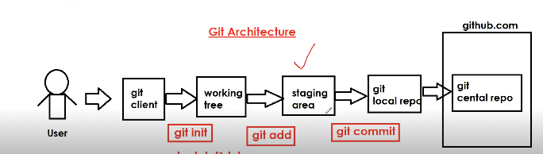

## What is Github ??

* It is version control software.

* __GitHub__ is a cloud platform which is used to store project related files/code.

* __Git__ is a version control software which is used to communicate with GitHub 

* In gitHub, we can create source code repository to store project code.

* All the developers can connect to project repository to store all the source code (__Code Integration will become easy__)

* GitHub repository will monitor all code changes.

   * __Who modified the code__ .
   * __When the code modified__ .
   * __What code modified__.
   * __Why the code modified__

> As a Devops engineer , we are responsible to take the code from the __GitHub__ , we need to __Compile__ the code , we need to __Test__ the code , we need to __Review__ the code , we need to __Package__ the code and we need to deploy that code into the server .

## What is GitHub Repository ?

* Repository is a place where we can store project source code / files.

* For every project one repository will be created. 

* We can create 2 types of repositories in GitHub.

   * __Public Repo__ : Anybody can see and you choose who can commit.
   * __Private Repo__ : We choose who can see and commit.

> As a DevOps engineer , we are responsible to create the repository in the Github.

## Environment Setup :

* Create account in www.github.com

* Download & Install git client software

* Open __Gitbash__ and configure your name and email.

  * __$ git config --global user.name "your-name"__
  * __$ git config --global user.email "your-email"__
   > Configuring name and email is just one time process.

## Architecture of the GitHub and various useful GIT commands:
 
  

 * __git init__ :  It will initialize one empty git Local Repository __(.git hidden folder will be created)__

   > __.git folder__ It is the local Repository which contains the information of Central Repository .
   
   > __We can't execute the git commands from any folder until the .git folder is not present there.__

   > __fatal: not a git repository (or any of the parent directories): .git__ : This issue comes when .git folder is not present in the working tree

 * __git status__ : To Check the status of the Working tree.

 * __git add__ : This command is used to add the files in the Staging area .

   > In staging area we put those files which we want to commit .

* __git commit__ : This command is used to move the files from Staging area to the Local Repository .

* __git push__ : This command is used to push the files from the Local Repository to the git Central Repository .
   
   > __NOTE :__ When we use the git push command for the first time in GitBash  , It will ask the password to enter , You can use the __Git token__ at that time . It is not recommended to use the __Git password__ , It is recommended to use the __Git Token__ instead of a password . 

   > __NOTE :__ When we are pushing the changes to the Repository for the first time , We need to establish the connection between the Working tree and the Central Repository. __(Configure the Remote Repo URL by executing the below three commands)__

     * __$ git branch -M main__

     * __$ git remote add origin https://github.com/sunny-coder97/axis_app.git__

     * __$ git push -u origin main__
     * 

     > Once the Connection is established , We can directly use __git push__  command.

     > __NOTE :__ While using the __git push command__ , only those files will be pushed to the Central Repository , which are commited in the Local Repository.

     

* __git restore__ : Below are the two usages of git restore command .

   * To discard the changes when the file is in unstaged state 

       * __$ git restore f1.txt__

   * To unstage the file when it is added to staging area .

      * __$ git restore --staged f1.txt__
    
* __git log__ : This command is used to see the commit history (It shows how many times we have done the commit to the remote repo)

* __git clone__ : This command is used to download the complete repository from Central Repository to the Local Repository .

  > When we clone any repo from the Central Repo , by default __.git folder__ will be available and we can directly execute the git commands and the __working tree would be clean__ .

* __git pull__ : It is used to download only latest changes from Central Repository to Local Repository .

* __git rm__ : This rm command is used to remove the files / directory from the Central Repository . Suppose we have mistakently pushed the target folder in the git remote repo.
   
   *  __git rm file.txt__ : __For removing the file ,file will be staged by default and ready to commit.__
   
   
   * __$ git rm -r target [All the recursive files of the target folder will be staged by default and ready to commit]__
   * __git commit -m "Deleted target folder"__
   * __git push__

   > __rm command => rm command+ commit command + push command__ (__First It will be removed from local__ through rm command and then we will commit and push it )

* __git diff__ : It is used to display the differences between Working Tree and Central Repository .

* __git gui__ : It is used to open the GIT-GUI editor .

## Git Branching :

 __<mark>Steps to create the feature branch for your personal Jira :__

* Do the __git pull__ on the main branch and cut the feature branch by using the below command 
   * __$ git branch feature__

* Checkout to the newly created feature branch , It can be feature or any branch.
    
    * __$ git checkout feature__ [ Now you are present at the feature branch]

* Do the changes , commit and push , It will be reflected in the feature branch .

* Once everything looks fine in the feature branch , we can merge the feature branch into the main branch that is called __Branch Merging__ 

<mark>__NOTE:__</mark>  __Once the branch is merged , We should delete that branch also from the Remote Repository.__

 __Pull Request :__ In order to do the branch merging in real time , we create the PR's (Pull Requests)

* __Git Branching Strategy :__

   * Branching Strategy defines which branch we need to use and which branch will contain the latest code and from which branch we will do the production deployments.

     * __main branch__ - latest code 
     * __develop branch__ - for ongoing developments 
     * __feature branch__ - any complex task 
     * __release branch__ - prod deployments 
   
## what is .gitignore file ?

It is used to configure files or folders which we want to exclude from git commits .

__Ex:__ In maven project,  We shouldn't push target folder to git repository hence we can give this info to git using .gitignore file and we should __push that .gitignore file__ on the Central Repo.

__NOTE:__ If we want someone to do the code changes to our repository , we can make them as Collaborators 

## git fetch vs git pull 

* __git fetch:__ It identifies that there are some changes happened in the Central Repository , but those are not downloaded to the working tree. It will download after executing the __git merge command__

   * __git pull = git fetch + git merge__

__NOTE :__ We can avoid the conflicts by using the fetch command 

## How we can revert the commit from the Local Repository

* If we commit anything in local then the branch is ahead of that a particular commit and we should push that change , but If want to revert that commit from the local repository we can use the below command.

   * __$ git reset --hard HEAD~2__ (We will go to 2 commits back in the local repository)

## How to revert our code changes grom Git Central Repository :

  * There are two ways to revert the changes that we have pushed on the Central Repo .

    * Whatever the changes that we did and pushed to the Central Repository , We should revert those changes from the local and again use __git add , git commit and git push command__ __[NOT GOOD APPROACH]__

    * use the __git revert command__ like below :

       * $ git revert __`<commitid>`__ : By executing this command our branch will get reverted by the one commit in local __[Your branch is ahead of 'origin/main' by 1 commit]__

       * Now execute the __git push__ command to push the reverted commit .
## Git stash command :

This command is used to save our working tree changes to a temporary area for the future purpose . I dont want to commit and delete the changes for now but for purpose it can be useful for me .

   * __$ git stash__  [ Working tree would be clean after executing this command ]

   * __$ git stash apply__ : [All the preseved changes will come and we have to commit and push it according to our need]

## What is git fork ?

*  It is heavily used and we will do everything on this repo and syncing should be enabled between the actual repo and forked repo __(It is cloning the Repo in our own account)__

## What is git patch ?

* We can create the patch of our local changes and give it to anyone and can also take the patch of someone else's changes and include those changes in our local branch.

## What is git cherry-pick ? 

 * It is used to cherry pick only that commit which you want , instead of all the commits.

__NOTE:__  Mainly cherry-pick is used for the bug fixes where we want to place that bugfix commit in all the version branches. It is also used when we accidentally made a commit in the wrong branch.

 

## Git Conflicts Issues:

* Conflicts usually occur when we merge one branch into another branch , even in the case of __git pull__ also we merge the branch of Remote Repo into our Local Repo . At that time conflict can occur.

* There is no automatic way to resolve the conflicts , We always manually resolve the conflicts.

__NOTE:__  First step is to take the latest pull on the main branch and then creature the feature branch.

  ### When the conflicts can come :

  * __<mark>Case 1: When each and every developer is working on the same branch on the remote repo.(VERY RARE CASE)__ 

    When you are doing the git push and someone has updated the remote branch few mins ago . It will reject the push . It will say first take the pull of the branch 
    
      * __(If Merge Conflict comes, Resolve it -> add , commit and push)__

      * __(If Merge Conflict does not come , do git push directly)__

   * <mark>__Case 2: In case of raising the Pull Request (VERY POPULAR CASE) :__

     If someone has updated remote branch , here also merge conflict can come. 

## Git 3 Branching Strategy :

<mark> __Develop Branch -> Release Branch -> Master Branch -> Production Build.__ 

### How release goes in production ? 

  * Take the changes from develop to release .

  * Run the regression tests on the release branch.

  *   Push to production live.

  * Monitor the live production build.(Once Monitoring completes , then update the master branch)

### Case 1:  

  * If we have pushed the code from release branch to production , and hotfix comes we can handle the hotfix on the release branch , run the regression on release brach , push the code to production , monitor it and back merge the develop and master branch .

### Case 2: 

*   Hotfix can come even in the live , while regression is happening on the release branch and code has not been pushed yet , in that case master branch can help us.

__NOTE:__ master branch is exactly equivalent to the production env.

## Git merge and Git rebase :

__Merge__ and __REBASE__  both are used to integrate the changes from one branch to another branch but in a different way. __It is an alternative to Pull Requests__

   * __git merge__ :

      * It preserves the non linear history of the commits and the new commit is added. 

      __<mark>NOTE :__ "merge" is very recommended whenever you are working on a branch on which multiple engineers are contributing it . 

      In the below example , suppose you are working on the feature branch and you have done multiple commits in the feature branch and parallely master is also getting updated by the peer developers . Now you want to test your functionality with all the changes that the developers have pushed into the master branch . In that case use __git merge master__  
      
      Execute the below commands :

         * git checkout master
         * git pull master
         * git checkout feature
         * git merge master
      In that case use __git merge master__ 

        * 

   * __git rebase__ :

      * It preserves the linear history of the commits by __rewriting the commits__ and the new commit wont be added .

        
    
      __NOTE:__  __NEVER-EVER run the rebase command from the main/master branch__ , It will messup the commit history of the developers that they already commited into the main/master branch .

      __NOTE:__ Always use git rebase on a branch where you are working it and no-one else is contributing to it .

