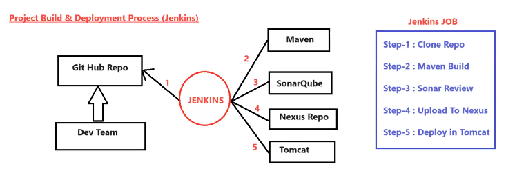
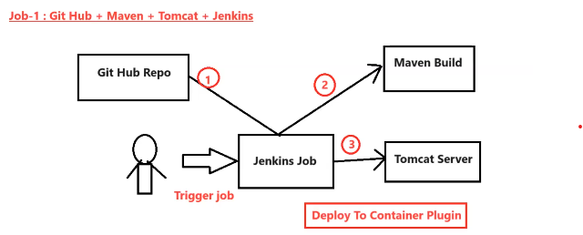
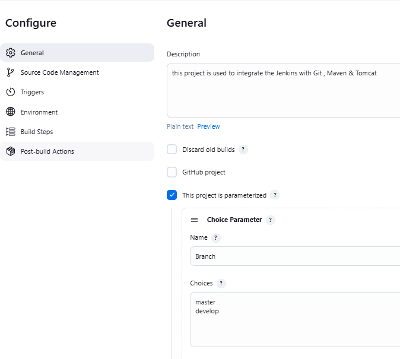
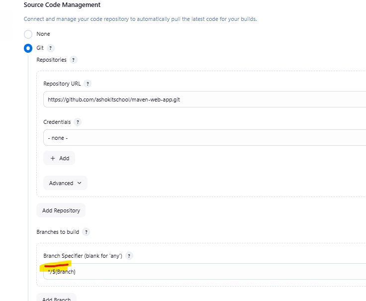
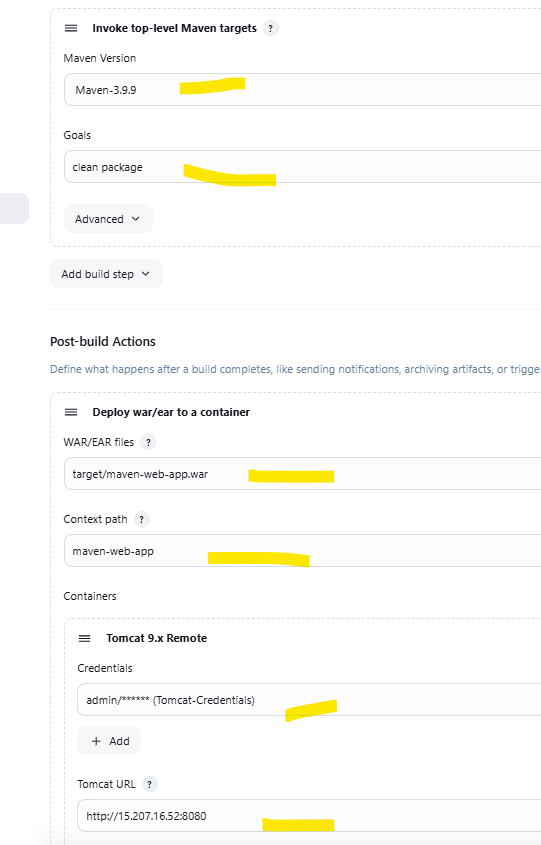
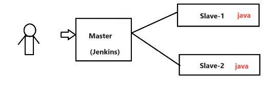
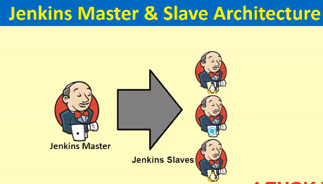
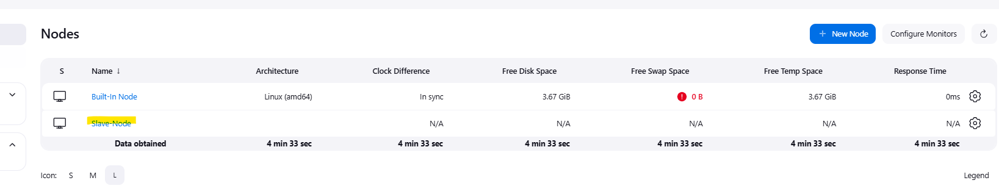
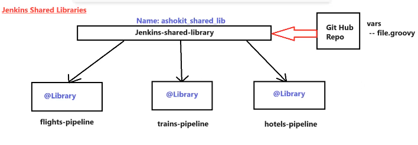
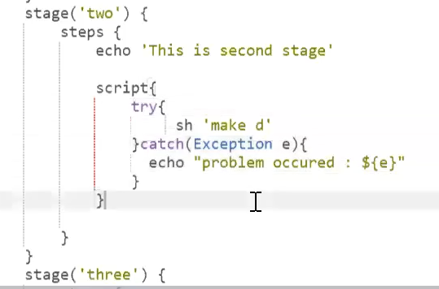

## What is Jenkins ?

* Jenkins is a __CI/CD server__ which is used to automate the Build & Deployment process.

* It is Open Source , Free & developed by using JAVA language.

* Using Jenkins , We can deploy any type of project __(Java , Python , Dotnet , React or Angular)__

## What is Build & Deployment Process ?

* Take latest code from __Github Repo.__
    
* Build source code using __Maven.__

* Perform code review using __Sonar.__

* Upload project artifacts into __Nexus.__

* Deploy code into __Apache Tomcat Web-Server.__ (If it's a web application)

   

__NOTE:__  In a single day multiple times code will be pushed to Github Repository , So multiple times we have to perform build & deployment process. If we do build & deployment process manually , then it is time taking process and error prone also .

__NOTE: To overcome above problem , automation of Build & Deployment process is required & that can be done via JENKINS.__

## Jenkins Setup :

   __NOTE:__ <mark>__We can run the Jenkins Server in t2.micro instance as well for practise.__</mark>

* Follow the below Github Repository to install the Jenkins in the EC2 machine .

   __Git Repo :__ https://github.com/ashokitschool/DevOps-Documents/blob/main/01-Jenkins-Server-Setup.md
   

   __Below are the Credentials to login into the Jenkins Server:__ 

     * __Username:__ admin
     * __Password:__ admin

     
## Creating first basic Jenkins Job (Free-Style Job) :

  *  Go to Jenkins Dashboard.

  * Click on new Item .

    * Enter Item Name (Job Name)
    * Select Free Style Project & Click OK
    * Enter some description & Click on __'Build'__ tab.
    * Click on 'Add Build Step' and select __'Execute Shell'__

* Enter below Shell Script 

   * __$ echo "Hello , Welcome to Jenkins !!"__
   * __$ touch ashokit.txt__

* Click on Apply & Save.

__NOTE:__ Click on __'Build Now'__ to start Job Execution

* Click on __'Build Number'__ and then click on __'Console Ouput'__ to see job execution details.

* __Jenkins Home Directory in EC2 :__  /var/lib/jenkins/workspace/

* Go to Jenkins home directory and check for the job name __->__ check the file created inside the job

## Steps to create Jenkins Job with Git Repo + Maven + Tomcat Server



* __Git__ was already installed as a plugin when we were doing the Jenkins Setup . You can check git version by using the below command.

  * __$ git --version__

* __Maven__ is not installed as a plugin earlier , So we have to install the maven . It is not recommended to install the maven version directly otherwise in all the jobs that same maven version will be used . Instead of that we will configure Maven as a __Global Tool.__ 

   *  __Jenkins Dashboard -> Manage Jenkins -> Tools -> Maven Installations__

__NOTE:__ <mark>__By doing the above step , Maven will be downloaded by the Jenkins itself & We can configure the different maven versions in our different jobs as well.__</mark>

* Setup the __Tomcat Server__ in different machine , Both Jenkins and Tomcat runs on the default port __8080 .__ It is not recommended to run both the heavy servers in the same machine and port change will also be required for that.

* Install __"Deploy To Container Plugin"__ in Jenkins to deploy code into the Server.

  * __Go to Jenkins Dashboard -> Manage Jenkins -> Plugins -> Goto Available plugins -> Search For "Deploy To Container" Plugin -> Install without restart.__

* Create Jenkins Job (Free-Style Project)

  *  __New Item__

  * __Enter Item Name (Job Name)__

  * __Select Free Style Project & Click OK__

  * __Enter some description__
		 
  * __Go to "Source Code Management" Tab and Select "Git"__
  
  * __Enter Project "Git Repo URL" : https://github.com/ashokitschool/maven-web-app.git__

  * __Go to "Build tab"__
  
  * __Click on Add Build Step and Select 'Invoke Top Level Maven Targets'__

  * __Select Maven and enter goals 'clean package'__
  
  * __Click on 'Post Build Action' and Select 'Deploy war/ear to container' option.__

  * __Give path of war file (You can give like this also : target/maven-web-app.war )__

  * __Enter Context path (give project name Ex: java_web_app)__

  * __Click on 'Add Container' and select Tomcat version 9.x__

  * __Add Tomcat server credentials (give the username & pwd which is having manager-script role)__

  * __Enter Tomact Server URL (http://ec2-vm-ip:tomcat-server-port)__

  * __Click on Apply and Save__


* Run the job now using 'Build Now' option and see 'Console Output' of job

* Once Job executed successfully, go to tomcat server dashboard and see application should be displayed.

* Click on the applicaton name (it should display our application)

__NOTE:__ <mark> __We are hard-coding the Tomcat Server URL in the Jenkins , which is not recommended . At the time of restart the Server , public IP will be changed everytime.__</mark>

## How to create the Jenkins Job with Build Parameters:

 Build parameters are used to supply dynamic inputs to run the Job, Using Build parameters we can avoid hard coding .

__EX : We can pass the branch name as build parameter.__
  
* Create New Item
* Enter Item Name & select Free Style Project.
* Select __"This project is parameterized"__ in General Section 
* Select Choice Parameter 
* __Name: BranchName__
* Choices : Enter every branch name in nextline
* __Branches to Build : */${BranchName}__

__NOTE:__ Now you won't see __'Buid Now' Option__ , It would be __'Build with Parameters' Option.__

__NOTE:__ <mark>__We can also configure in the Jenkins Job to run Job automatically at the particular buffer time or We can use GitHub Hooks, Poll SCM (a Jenkins feature that checks a source code repository for changes and triggers a build when it detects new changes) etc.__</mark>

    

  

__NOTE:__ Deploying the code into server from different branches was getting failed , because the war name was getting changed everytime  from different branches __01-maven-web-app.war and maven-web-app.war___ 
## User's & Roles Management in Jenkins :

* In Our Project multiple teams will be available.

  * __Development Team (10 members)__
  * __Testing Team (5 members)__
  * __DevOps Team (3 members)__

* For every Team member Jenkins login access will be provided.

* Every team members will have their own user account to login into jenkins.

* Operations team members are responsible to create / edit / delete / run jenkins jobs.

* Dev and Testing team members are only responsible to run the jenkins job.

## Working with User-Groups in the Jenkins :

__NOTE:__ <mark>__Managing the permissions at the User level is not recommended . It is always a good approach to manage the permissions at the Group level.__</mark>

   * __Step 0: Create the Users__ 

     * Go to "Manage Jenkins" > "Users" > Create User

   * __Step-1 : Install Required Plugins__
   
     * Install "Role-based Authorization Strategy" Plugin
     * This plugin allows you to define roles and assign them to users or groups.


  * __Step-2 : Configure Security__ 

    * Go to "Manage Jenkins" > "Security."
    * Select Authorization as "Role-Based Strategy"
    * Click "Save" to apply the changes

  * __Step-3 :  Create User Roles__
  
    * Go to "Manage Jenkins" > "Manage and Assign Roles > "Manage Roles"

    * Click "Manage Roles" and define new roles based on your requirements (e.g., admin, developer, tester).
   
    * Click "Add" to create a new role, and specify the permissions for that role.


* __Step-4 : Assign Users to Roles__

  * After creating roles, go to "Manage Jenkins" > "Manage and Assign Roles" > "Assign Roles"
  * Select a user and click "Assign Roles" to add them to one or more roles.


* __Step-5 : Test the user login functionality__

__NOTE :__  Usually __'Developers'__ create the Jenkins Jobs for the __Non-Prod Environments__ and they can go with the User-Group-level access.

## Jenkins - Master & Slave Architecture:


* If we use single machine Jenkins, then burden will be increased if we run multiple jobs at a time .

* If burden increased , then system can crash.

  __NOTE:__ __'executors'__ are number of threads to run the multiple jobs parallely on the same Jenkins Machine . It is not recommended to increase the more number of executors on the same jenkins machine because of the burden.

* To reduce burden on jenkins server we will use __Master & Slave Architecture.__

* __Master & Slave Architecture__ is used to reduce burden on Jenkins Server by distributing tasks/load.

  ### What is Jenkins Master ?

    * The machine which contains the Jenkins Server is called as Jenkins Master Machine .
    * It is used to create the Jobs.
    * It is used to schedule the Jobs.
    * It is responsible to distribute Job's Execution to slave machines.

    __NOTE:__ We can run jobs on Jenkins master machine directly but it is not recommended.

  ### What is Jenkins Slave ?

    * The machine which is connected with 'Jenkins-Master' machine is called as 'Jenkins-Slave' machine.
    * Slave Machine will receive task from 'Master-Machine' for Job execution.

     

  ### Configuring Jenkins Master & Slave Architecture :

    * __Step 1: Create Jenkins Master Virtual Machine.__
    
    * __Step 2: Create Jenkins Slave Virtual Machine.__

      * Launch EC2 Linux VM (Ubuntu AMI)
      * Connect with Linux VM using Mobaxterm.
      * Install Java software to build the Java Project.

        * $ sudo apt update

        * $ sudo apt install default-jre
      * Create One directory (__/home/ubuntu/slavenode__)

        * $ mkdir slavenode 

      __NOTE: <mark>We are not installing the maven on the slave machine directly , because the maven is configured as a __Global Tool__ , where-ever the job is going to execute maven tool it will take from the master only because of the global tool & git client by default comes in the ubuntu machine. This is the reason we don't install those softwares in the slave machines which are configured as a global tool in the Jenkins Master Machine .__</mark>

    * __Step 3 :Configure the Jenkins Slave VM in the Jenkins Master VM.__

      * Go to Jenkins Dashboard

      * Go to Manage Jenkins
      * Select Nodes option
      * Click on 'New Node' -> Enter Node Name -> Select Permanent Agent
      * Enter Remote Root Directory ( /home/ubuntu/slavenode )
      * Enter Label name as Slave-1
      * Select Launch Method as __'Launch Agent Via SSH'__
      * Give Host as __'Slave VM DNS URL'__
      * Add Credentials ( Select Kind as : SSH Username with private key )
      * Enter Username as : ubuntu
      * Select Private Key as Enter Directly and add private key

        * __NOTE:__ Open pem file and copy content & add the content.

      * Select Host Key Strategy as __'Manually Trusted Key Verification Strategy'__

      * Click on Apply and Save (We can see below configured slave)

        

        __NOTE:__ <mark>__With above steps Master and Slave Configuration Completed.__</mark>

      * Go to Jenkins Server and Create Jenkins Job or configure the existing Job.

      *  Under General Section of Job creation process, Select __"Restrict Where This Project Can Run"__ and enter Slave Node Label name and finish job creation.

      * Execute the Job using __'Build Now'__ option.

        __NOTE:__ <MARK> __Job will be executed on Slave Node (Go to Job Console Ouput and verify execution details)__ <MARK>
 
## Jenkins Slowness Issue :

when we stop and start the Jenkins ec2 instance again , the IP address would actually change , So due to this issue whenever we try to bring up Jenkins , it would try to access in the background old IP url . To fix this issue , just follow the below steps :

  * __$ cd /var/lib/jenkins__
  * __$ sudo nano jenkins.model.JenkinsLocationConfiguration.xml__
  * __$ sudo service jenkins restart__

## Jenkins Pipeline :

* In Jenkins , we can create Jobs in 2 ways :

  * __Free Style Project (GUI)__
  * __Pipeline (Using in Realtime)__

* Pipeline means set of steps to automate build & deployment process.

* Using Pipelines , we can handle complex build & deployment tasks.


* We can create pipeline in two ways :

  * __Scripted Pipeline__
  * __Declarative Pipeline__

__NOTE:__   If you are not able to see the stages of a Job in the Jenkins UI , install this plugin __Pipeline Stage View Plugin.__


* Create the __Pipeline Project__ by clicking on __New Item__ and write the below stages in the pipeline script which will integrate with __<mark>Github , Maven , SonarQube , Nexus & Tomcat. (Below is the Scripted Pipeline Code)__

   
   
     ### Step-1 : Add github stage to clone git repository

     Git Credentials are required , when the Repository is __Private Repository.__

   __1)__ Use Pipeline Syntax and Generate Script for Git Clone with Repo Details

    ```     
    git credentialsId: 'GIT-Credentials', url: 'https://github.com/ashokitschool/maven-web-app.git'
    ```

   __2)__ Add Generated Script in Pipeline as a stage

   ```
   stage('clone repo') {        
  git credentialsId: 'GIT-Credentials', url: 'https://github.com/ashokitschool/maven-web-app.git'
   }
   ```
      
   ### Step-2 : Create Maven Build Stage (Add maven in global tools)

   1) Configure Maven as Global Tool in Manage Jenkins

   2) Add Maven Build Stage in Pipeline
   ```
   stage ('Maven Build') {
       def mavenHome = tool name: "Maven-3.9.4", type: "maven"
       def mavenCMD = "${mavenHome}/bin/mvn"
       sh "${mavenCMD} clean package"
  }
   ```
  
  ### Step-3 : Add SonarQube stage

   1) Start Sonar Server 
   
   2) Login into Sonar Server & Generate Sonar Token 
	
    * __Ex:__ cedbc0b89e45c58f4a86e4687f2df2a2241e3369

   3) Add Sonar Token in 'Jenkins Credentials' as Secret Text.
			
       __Manager Jenkins -> Credentials -> Add Credentials -> Select Secret Text -> Enter Sonar Token as Secret Text.__ 
			

   4) Install SonarQube Scanner Plugin.

      __Manage Jenkins -> Plugins -> Available -> Sonar Qube Scanner Plugin -> Install it__

   5) Configure SonarQube Server 

      __Manage Jenkins -> Configure System -> Sonar Qube Servers -> Add Sonar Qube Server__ 
		- Name : Sonar-Server-7.8
		- Server URL : http://52.66.247.11:9000/ __(Give your sonar server url here)__
		- Add Sonar Server Token

  6) Add SonarQube Stage in Jenkins Pipeline

    ```
     stage('SonarQube analysis') {
	withSonarQubeEnv('Sonar-Server-7.8') {
	def mavenHome = tool name: "Maven-3.8.6", type: "maven"
	def mavenCMD = "${mavenHome}/bin/mvn"
	sh "${mavenCMD} sonar:sonar"
    }
  }
   ```
  __NOTE:__ This Sonar-Qube Scanner plugin should be compatible with the SonarQube Version , otherwise it will fail . This Sonar Server 7.8 is very old.

  ### Step-4 : Create Nexus Stage

   1) Run nexus VM and create nexus repository named "ashokit-snapshot-repository"

   2) Create Nexus Repository 

   3) Install Nexus Repository Plugin using Manage Plugins __(Plugin Name : Nexus Artifact Uploader)__
   4) Generate Nexus Pipeline Syntax

   __NOTE:__ While adding the Nexus Credentials , we have used the kind __"usernname with password"__

  ```
  stage ('Nexus Upload'){
  nexusArtifactUploader artifacts: [[artifactId: '01-Maven-Web-App', classifier: '', file: 'target/01-maven-web-app.war', type: 'war']], credentialsId: 'Nexus-Credentials', groupId: 'in.ashokit', nexusUrl: '13.127.185.241:8081', nexusVersion: 'nexus3', protocol: 'http', repository: 'ashokit-snapshot-repository', version: '1.0-SNAPSHOT'
  }
  ```

  ### Step-5 : Create Deploy Stage

  1) Start Tomcat Server 
  2) Install __SSH Agent plugin__ using Manage Plugins 
  
      __NOTE:__ To communicate from Jenkins Machine to Tomcat Machine , __we use this SSH Agent Plugin.__
  
  3) Generate SSH Agent and configure stage through Pipeline Syntax .

     __NOTE:__ While Configuring the SSH Agent __'Tomcat Server Agent'__ ,we have used the kind as __SSH Username with private key.__ (ec2-user will be used here as a SSH user name with PEM file as a private key) 


  ```
  stage ('Deploy'){ 
  sshagent(['Tomcat-Server-Agent']) {
  sh 'scp -o StrictHostKeyChecking=no target/01-maven-web-app.war ec2-user@15.207.100.83:/home/ec2-user/apache-tomcat-9.0.80/webapps'
  }
  }
  ```
__NOTE:__ <mark>__If It's a Monolithic project , there will be only single jenkins job for a project , but if it is a MicroServices project , there will be a separate jenkins job for each microservice.__

## Email Notification in Jenkins 

 * We can configure Email notifications in Jenkins

 * With this option we can send email notification to team members after jenkins job execution completed.

 * We need to configure __SMTP Server Details__ to send emails
 
    * Go To Manage Jenkins 
		* Go To System
		* Go to "Extended E-mail Notification"
		* We should add company provided SMTP server details to send emails.

__NOTE:__ For practise, we can use __GMAIL SMTP Properties__

       * SMTP Server : smtp.gmail.com
       * SMTP Port : 465

__NOTE:__ Under Advanced section add your gmail account credential for authentication purpose __(Kind : Username with password  )__ &  Select use SSL Checkbox.

__NOTE:__ Sometimes it does not consider the gmail password , Instead of gmail password we need to add gmail app password

*  URL To generate gmail app pwd : https://myaccount.google.com/apppasswords

### Declarative Pipeline Syntax with Email Notification :

__"emailtext"__ is a plugin that got installed during the jenkins setup .
```
   pipeline {
    agent any
    
    tools{
        maven "Maven-3.9.4"   //It will be configured as a Global Tool.
    }

    stages {
        stage('Clone') {
            steps {
                git 'https://github.com/ashokitschool/maven-web-app.git'
            }
        }
        stage('Build') {
            steps {
                sh 'mvn clean package'
            }
        }
    }
    
	   post {
			failure {
				emailext(  
					subject: "Build Failed: ${currentBuild.fullDisplayName}",
					body: "The build ${currentBuild.fullDisplayName} failed. Please check the console output for more details.",
					to: 'ashokitschool@gmail.com',
					from: 'ashokit.classes@gmail.com',
					attachLog: true
				)
			}
			success {
				emailext(
					subject: "Build Successful: ${currentBuild.fullDisplayName}",
					body: "The build ${currentBuild.fullDisplayName} was successful.",
					to: 'ashokitschool@gmail.com',
					from: 'ashokit.classes@gmail.com',
					attachLog: true
				)
			}
		}    
}
```
## Jenkins Job with Parallel Stages:

```

pipeline {
	
	agent any

	stages{
		stage('git clone'){
			steps{
				echo 'git clone....'
			}
		}
		stage('maven build'){
			steps{
				echo 'maven build...'
			}
		}

		stage('parallel stage'){
		    parallel{
		        stage('code-review'){
		          steps{
		              echo 'code review....'
		          }
		        }
		        stage('nexus-upload'){
		            steps{
		                echo 'nexus upload...'
		            }
		        }
		    }
		}

		stage('deploy'){
			steps{
				echo 'deployment...'
			}
		}
	}
}
```
## Working with Shared Libraries in Jenkins : (Pipeline Code Reusability)

* When we are dealing with multiple projects related pipelines then we can see some common logics in all pipelines like :

  * __maven build__
  * __code review__
  * __artifact upload__

* Instead of writing same logic in multiple pipelines, we can write the logic at one place and we can re-use it.

* To achieve pipeline logic re-usability we will use __'Shared Libraries'__ concept.

* To create shared libraries for jenkins, we will use __'groovy scripting'__

   


   * Create Git Repo and push shared libraries related Groovy Files .
   
   * Configure Shared Libraries in Jenkins __(Manage Jenkins -> System -> Global Pipeline Libraries)__

   * Create Pipeline & use __Shared Libraries.__

   * Refer the below Git URL to see the groovy files.

     * https://github.com/ashokitschool/my_shared_libraries.git

   __NOTE:__ <mark>It internally searches for call() method in the Groovy File.

```
@Library('ashokit_shared_lib') _

pipeline {
    agent any
    
    tools{
        maven "maven-3.9.8"
    }

    stages {
        stage('Hello') {
            steps {
               welcome()
            }
        }

        stage('git clone'){
        	steps{
        		gitClone()  // Coming from Shared Library
        	}
        }

        stage('maven build'){
        	steps{
        		mavenBuild()  // Coming from Shared Library
        	}
        }

        stage('Code Review'){
          steps{
            sonarQube()   // Coming from Shared Library
          }
        }
    }
}
```
 
## What is Jenkins File ?

In that file, we write the pipeline code and that file will be checked-in into the code , while configuring the Job in the jenkins we can choose __Pipeline Project -> Pipeline Script from SCM__ 

__NOTE:__ Each branch in the Git Repository will be having it's own Jenkinsfile.

## Exception handling in the pipeline Job's:

* If any stage fails in the pipeline , all the remaining stages after that will not perform its activity due to earlier failure .   <mark>__If we don't want abnormal termination__</mark>, It is better to use the exception handling in the pipeline Job's.


  *  


## Multibranch Pipeline:

  * Multibranch Pipeline is used to build the code from multiple git branches at a time.

     * main branch
     * develop branch
     * feature branch
     * release branch

__NOTE:__ <mark>Every branch will have its own __'Jenkinsfile'__

* Create the multibranch pipeline project from Jenkins and configure the details there ( You can include all the branches & exclude the branches as well)


* When we click on __Scan Multibranch Pipeline Now__ , it will build the branches if there are any code changes in the branches.


__NOTE:__ <mark>__By using the Multibranch Pipeline concept , we can create only pipeline for multiple branches.__

## How to take Jenkins Backup ?

* Using "Thin Backup Plugin" we can backup our jenkins configuration and we can restore .

  __NOTE:__ After restoring , just restart the Jenkins Server.

     * URL : http://public-ip:8080/restart

__NOTE:__ We will take the backup of only Jenkins Master Machine (Because every job details is stored in the master machine , slave machine is just a dummy box where our job will run)

