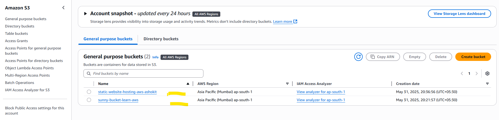
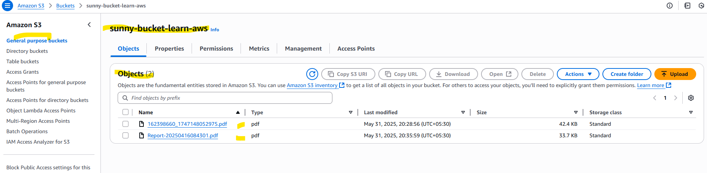

## AWS S3 (Simple Storage Service):

* S3 stands for simple storage service

* S3 is used for unlimited storage

* S3 works based on Object storage (object = file)

* S3 is a paid service (for storing & for retriving)

* S3 maintains data using buckets concept

* Buckets are used to seperate objects logically.
  Bucket means group of objects
  
    * __netflix_tollywood_movies_bucket__
	 * __netflix_bollywood_movies_bucket__
	 * __netflix_hollywood_movies_bucket__

__NOTE:__ When we create bucket, aws will generate one URL for that.

__NOTE:__ When we upload object in the bucket then object url will be generated.

* We can upload the objects in s3 bucket by the below following ways :

   * __<mark>Using Web Console__
   * __<mark>Using Programmatic access__ 

## Static Website hosting using S3 :

* Website nothing but collection of web pages.
   * __Ex: login page, register page, services, about us page, contact us page...__

* Websites are divided into 2 types
  
  * static website
  * dynamic website

* The website which gives same response/content for all users is called as __static website.__	

* The website which gives response based on user is called as __Dynamic website.__ 

__Git Repo:__ https://github.com/ashokitschool/s3_static_website_hosting

__Step-1 :__ Create S3 bucket

  * Enable ACL
  * Allow Public Access

__Step-2 :__ Upload website files (index.html & error.html) as objects in bucket

 * Grant public read access

__Step-3 :__ Enable static website hosting

 * bucket -> properties -> static website hosting

__Step-4 :__ Access website URL			

  * URL : http://ashokitwebsite001.s3-website.ap-south-1.amazonaws.com/  

__NOTE:__ <mark> __After the usage , delete all the objects from the bucket and then delete the bucket also to avoid billing.__