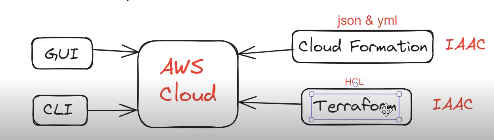

## AWS CloudFormation :

* Cloud Formation service is used to provision infrastructure in AWS Cloud.

* Cloud Formation works based on __'Infrastructure as a code' (IAAC)__

* Cloud Formation supports JSON and YML configurations

   __NOTE:__  If we create infrastructure manually it takes lot of time and it is error prone.
   
* If we design cloud formation template to create Infrasture then we can re-use that template.

   __NOTE:__ Cloud Formation service works only in AWS Cloud.

    __NOTE:__ The alternate for 'Cloud Formation' service is 'TERRAFORM' tool. 

* Terraform works with almost all cloud platforms available in the market.

   

### Creating EC2 instance using Cloud Formation:

* Go to AWS Management Console and Navigate to __'Cloud Formation'__

* Click on Create Stack and upload below Template File.

```
Description:  Ashok IT - Build Linux Web Server
Parameters:
  LatestAmiId:
    Description: AMI Linux EC2 
    Type: 'AWS::SSM::Parameter::Value<AWS::EC2::Image::Id>'
    Default: '/aws/service/ami-amazon-linux-latest/amzn2-ami-hvm-x86_64-gp2'
Resources:
  webserver1:
    Type: AWS::EC2::Instance
    Properties:
      InstanceType: "t2.micro"
      ImageId: !Ref LatestAmiId
      SecurityGroupIds: 
        - !Ref WebserverSecurityGroup
      Tags:
        - Key: Name
          Value: webserver1
      UserData:
        Fn::Base64: !Sub |
          #!/bin/bash -xe
          yum update -y
          yum install httpd -y
          service httpd start
          chkconfig httpd on
          cd /var/www/html
          echo "<br>" >> index.html
          echo "<h2><b>Ashok IT EC2 Linux Demo</b></h2>" >>index.html
  WebserverSecurityGroup:
    Type: AWS::EC2::SecurityGroup
    Properties:
      GroupDescription: Enable Port 80
      Tags:
      - Key: Name
        Value: webserver-sg
      SecurityGroupIngress:
      - IpProtocol: tcp
        FromPort: 80
        ToPort: 80
        CidrIp: 0.0.0.0/0
```

* Verify EC2 dashboard, we can see EC2 instance created

* Access EC2 VM public in browser.
