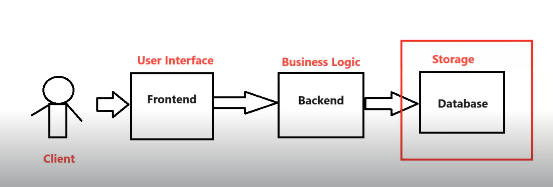
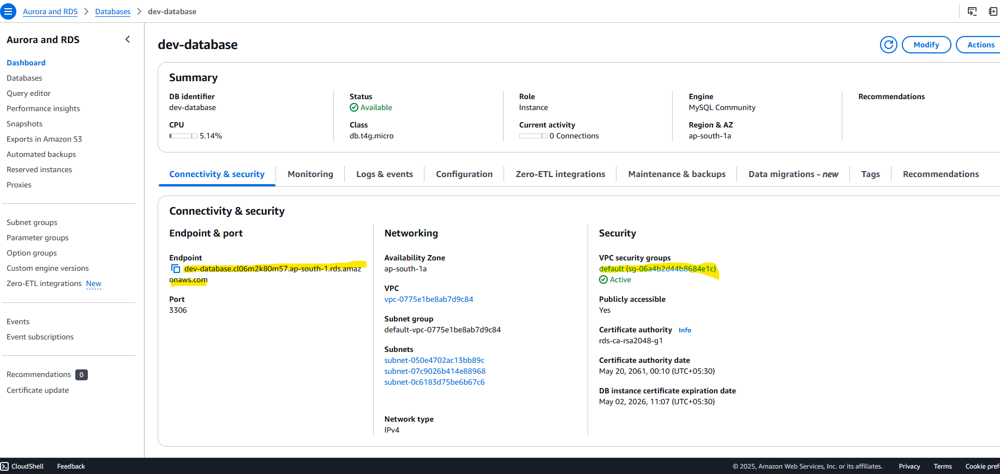
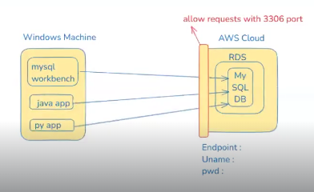
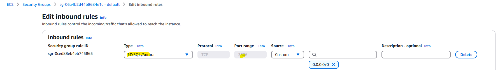
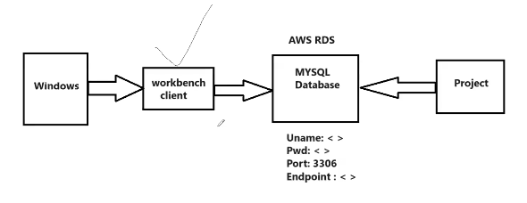
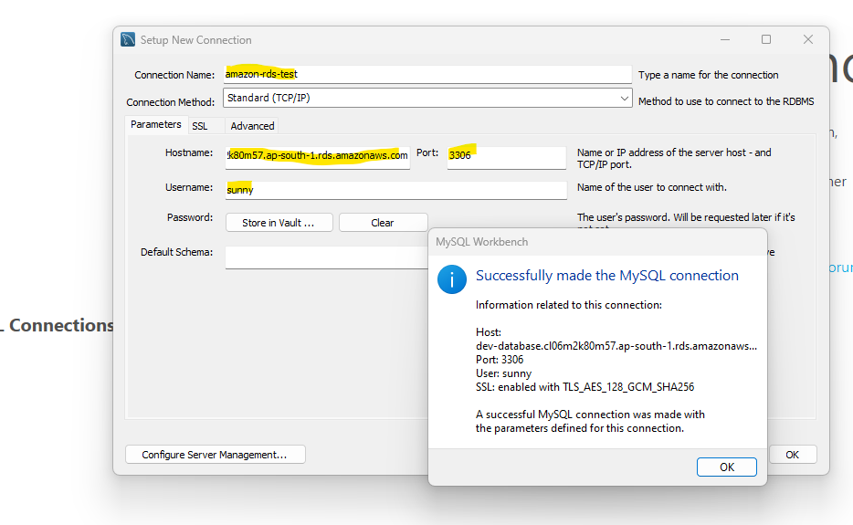
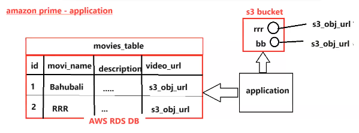

## AWS RDS (Relational Database Service):

__Application Architecture:__   

   

  * __Frontend__ - User Interface (UI)
  
  * __Backend__ - Business Logic
 
  * __Database__ - To store and retrieve data 

__NOTE:__ For every project , database is mandatory to store the data permanently.

__Database Setup in Local Machine :__ 

  * We can download and install database in our local system to store the data permanently .

  * If we setup database on our own then below are the challenges :

    *  __Database Security__
    *  __Privacy__
    * __Scalability__
    * __Availability__
    * __Backup__
    * __Disaster Recovery__

     To overcome the above challenges , we can use the Cloud Database giving by the Cloud Provider.

__Database Setup in Remote Machine__ 

 * Even if we install the database on the ec2 instance (Its like Remote Database) , then we have to manage everything by ourselves , instead of doing that, we always prefer the RDS Service.

__What is AWS RDS ?__

  * RDS is a fully managed service in the AWS Cloud .

  * Using RDS , we can create relational databases in AWS Cloud .

    * __Oracle , MYSQL , SQLServer , PostgresSQL etc ..__

  * If we setup database using RDS then AWS will take care of the administration related activities.
    
    * __Security , Backup , Recovery , Scalability & Availability.__

  * We are just responsible to create and use the database , the remaining things will be taken care by AWS Cloud .

   

__NOTE:__   AWS RDS is a paid service , It is chargeable based on the usage , AWS providing RDS based on <mark> __Pay As You Go Model.__</mark>

__MYSQL DB Setup using AWS-RDS:__

1) __Standard Create__

2) __MySQL Engine__

3) __Template - Free Tier__

4) __DB instance Identifier - Give Any Name__ 

5) __Credentials Settings:__ 

   * __Master Username:__
   * __Master Password:__

5) __Public Read Access - Yes__

6) __Additional Configuration:__ 

   * __Initial Database Name - Give Any Name__ 

7) __Create Database__

__<MARK>Once database created , it will provide database connection properties.__

  * __DB Username__: <>
  * __DB Password__ :<>
  * __DB Port Number__ :<>
  * __DB EndPoint__:<>

__NOTE:__ <MARK> __Enable 3306 in database Security Group Inbound Rules to allow the income traffic to access the database__</mark>

* 

__Checking RDS DB Connectivity:__

* Download and install mysql workbench.

* Create Connection in Workbench by using the above credentials and execute the SQL Queries.

## AWS RDS vs AWS S3 :

* __AWS RDS :__ This service is responsible to store the text data in the database tables .

* __AWS S3 :__  This service is responsible to store the Object data(Files) in the S3 buckets.

__<mark>NOTE:__ For connecting with databases , __programmatic access__ is not required. we can directly connect with the database via __DB end point URL(host)  , port , uname and password.__

__<MARK> NOTE:__ for __S3 communication__ , access keys are required ,__RDS communication__ access keys are not required.