## AWS EC2 (Elastic Compute Cloud):

* It is Most demanded service in AWS

* It is Used to create Virtual Machines in AWS cloud

* EC2 VM is called as EC2 instance

    __EC2 Instance__ = <mark>__Computer / Server / VM / Virtual Machine / Virtual Box__<mark>

* EC2 instance is re-sizable (we can change configuration based on demand)

* EC2 is a paid service (hourly billing)

* EC2 VM Minimum billing period is 1 hour

  __9:00 AM to 9:15 AM => 15 mins => 1 hour billing__

  __9:30 AM to 9:45 AM => 15 mins => 1 hour billing__

__NOTE:__ To encourage beginners, AWS provided t2.micro/t3.micro for 1 year free
 (monthly 750 hours)

* EC2 VM will have storage with EBS service

  * __EC2 VM with Windows OS__ : 30 GB (default)
  
  * __EC2 VM with Linux OS__ : 8 GB (default)
  
  * __EBS max capacity__ : 16 TB (16000 GB)

* For EC2 instances network will be provided by __VPC service.__

* For EC2 vm creation we will use AMI (Amazon Machine Image)

__NOTE:<mark>AMI represents configuration required for the machine__

 * Windows AMI
 * Amazon Linux AMI
 * Ubuntu AMI
 * RedHAT AMI

__What is Key-Pair ??__

* It is used to connect with machines securely 

* It is a combination of __Private Key(It will be maintained by AWS) & Public Key__

* One Key Pair we can use to __create multiple Vm's.__

   

__NOTE:__ <mark> If we lost the key pair , we wont be able to connect to the EC2 machines.


__What are Security Groups?__

* To Configure the Firewall rules.

* To decide the Incoming & Outgoing Traffic.

* It is used for In-Bound Rules & Out-Bound Rules.

  * __In-Bound Rules :__ Incoming Traffic 
  * __Out-Bound Rules :__ Outgoing Traffic 

  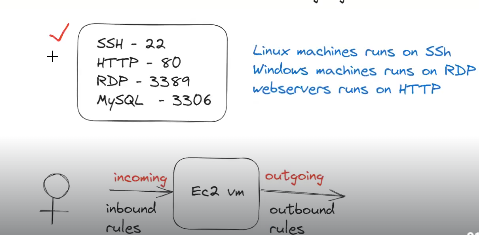

__NOTE:__ One Security Group (SG) we can use for multiple EC2 instances.

__Types of IP's:__


* __Private IP :__ (Fixed -IP , Internal Purpose)

* __Public IP :__ (Dynamic IP , will change when we restart VM)

* __Elastic IP :__ (Fixed Public IP , Commercial)

__TASK -1 :__ 

  * Create the Windows Virtual Machine and Connect through __RDP Client(Remote Desktop Connection) by entering the username and password__

    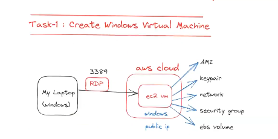

__TASK 2:__

 * Create the Linux Virtual Machine and Connect through __Mobaxterm.__

    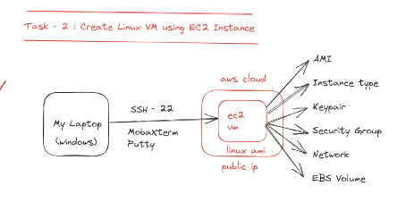

__TASK 3:__

 * Working with __Elastic IP.__

   * Create Linux VM.
   * Allocate Elastic IP.
   * Associate Elastic IP with Linux VM 
   * Stop the Machine and observe Public IP 
   * De-Associate Elastic IP from Linux VM 
   * Release Elastic IP .

## AWS EBS Volumes & Snapshots:

* EBS stands for __Elastic Block Store.__

* EBS is a block level storage device that can be associated with the EC2 instance.

* EBS is providing both Primary & Secondary Storages for EC2 instance .

* __EBS Volumes are divided into 2 types :__

  * __Root Volume :__   <mark>(Its like the Hard Disk, where the OS will be installed)
  * __Additional Volume :__ <mark>( It's like a Additional Storage like PenDrive )

* When we launch EC2 instance , by default root volume will be associated.

__NOTE:__ Root Volume is manadatory to launch EC2 VM.

__NOTE:__ <mark>__EBS Additional Volumes are Optional , Based on requirement we can attach or detach Additional Volumes from the EC2 instances.__

* EBS Volume capacity is __16 TB: 16000 GB__

  * __Linux AMI default EBS Volume Size : <mark>8 GB__
  * __Windows AMI default EBS Volume Size : <mark>30 GB__

    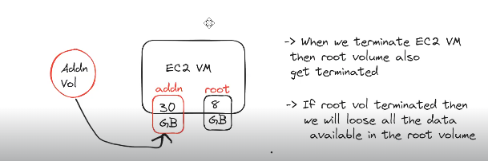

__NOTE:__ <mark>__If I terminate my EC2 instance, root volume will be deleted and all the data which was stored in the root volume will be lost.__

__NOTE:__ After launching, if we detach __ROOT VOLUME__ , then we can't start EC2 VM (<mark> because OS is present in the root volume and without OS, machine can't start.)

__NOTE:__ <MARK>__EC2 Instances are regional specific , Volumes are AZ Specific.(Volumes should be in the same available zone only where our machine is available)__


__What are EBS Volume Types ??__

* We have 5 types of EBS volumes

    1) General Purpose (Min: 1 GiB, Max: 16384 GiB)

    2) Provisioned IOPS (Min: 4 GiB, Max: 16384 GiB)

    3) Cold HDD (Min: 125 GiB, Max: 16384 GiB)

    4) Throuput Optimized (Min: 125 GiB, Max: 16384 GiB)

    5) Magnetic (standard) (Min: 1 GiB, Max: 1024 GiB)

* __Some important points about the Volumes:__

  * __Volumes are AZ specific.__
  * __One Volume can be attached with one VM at a time.__
  * __One EC2 can have multiple Volumes.__ 

   
   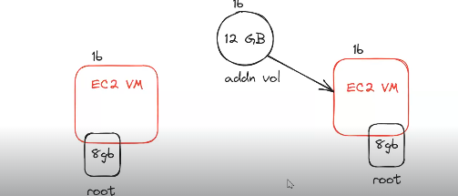

__<MARK>Lab Task on EBS Additional Volumes:__
    

* Create EC2 VM (VM-1) (amazon linux ami) - we will get EBS root vol 8 GB

* Create Additonal EBS Vol with 10 GB __(check AZ's of the machine),__

* Attach Additional Volume to EC2 VM-1

__NOTE:__ Now EC2 Vm-1 will have 2 EBS volumes __(root vol + additional vol)__

* Connect with VM-1 and check volumes attached

  * __$ lsblk__

* Store the data in additional volume using mounting with below commands

  * $ __sudo mkfs -t ext4 /dev/sdb__

  * $ __mkdir ashokit__

  * $ __sudo mount /dev/sdb ashokit__

  * $ __cd ashokit__

  * $ __sudo touch f1.txt f2.txt__
    
* Detach additional volume from EC2 VM-1

* Create New EC2 VM (VM-2) and attach EBS additional volume to EC2 VM-2

* Check the data is present or not.

  * $ __lsblk__
  * $ __mkdir demo__
  * $ __sudo mount /dev/sdb demo__
  * $ __ls -l demo__

__NOTE:__ Once practice is completed, detach additional volume and delete it to avoid billing.

* __One ec2 instance can have multiple volumes__ , To check the Volumes of a machine we can use __'lsblk'__ command. 


__<mark>What are EBS Snapshots??__

* Snapshots are used for EBS Volume backup .

* Snapshots are __region specific.__

* From Volume, we can create Snapshots.

* From Snapshots , we can create Volume.

   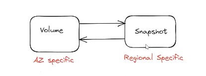

__NOTE:__ Volumes can be attached to EC2 instances directly.

__NOTE:__ We can't attach Snapshot to EC2 instances directly .

<mark>Q. __How to copy data from one zone machine to another zone machine ??__

  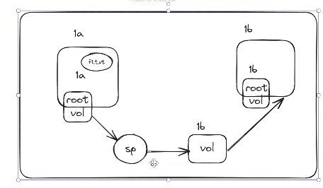


## Static Website Hosting using EC2 instance:

  * __Website__ -> Collection of web pages.

  * We have two types of Websites :

    * __Static Website :__ Same Content for all users.

    * __Dynamic Website :__ Content based on each user 

  * In order to run a website , we need a __WebServer.__

  * WebServer is a software which provides runtime environment(Platform) to run the Web Applications.

  * __Install Web-Server(Httpd) by following the below commands:__

    * __$ sudo yum update -y__

    * __$ sudo yum install httpd__

    * __$ sudo systemctl start httpd__

  __NOTE:__ Enable HTTP in Security Group Inbound Rules (Port :80)

  * Access the website using EC2 public IP (We should be able to see the Test web page)

  * We can change the content of our website using below commands: 

    * __$ cd /var/www/html__

    * __$ sudo vi index.html__ (Add the html in the index.html that you want to see in the web browser)

  * Access the website again using EC2 VM public IP with our updated content.

## What is User Data in the EC2 ?

 * User Data is used to execute the script when ec2 instance launched for the first time.

 * We can say user data is the default script to execute when EC2 instance is launched.

__NOTE:__ If we stop and start the ec2 machine then User Data will not execute .

```sh
#! /bin/bash

sudo su
yum install httpd -y
cd /var/www/html
echo "<html><h1>Life Insurance Server - 1</h1></html>" > index.html
service httpd start
```

## Load Balancing in the EC2 :

* When we run our application in Single Server then we may get below issues ;

  * __Burden on Server.__

  * __Slow Responses.__

  * __Server can Crash__

  * __Application Down-Time__

  * __Effect on the Brand Value__

  * __Revenue Loss__

    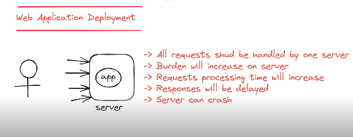

__NOTE:__ To Overcome these issues , we will go for __Load Balancing.__

* Load Balancing is the process of distributing application load to multiple servers .

* Instead of deploying our application in one server , we will deploy in multiple servers

* All the servers will be connected to the __Load Balancer.__

* Load-Balancer will distribute traffic to all connected servers using Round Robin Fashion.


   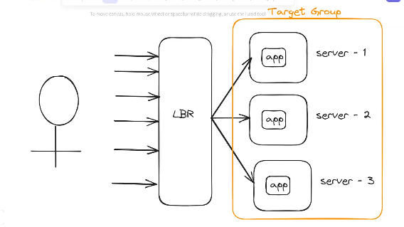

* In AWS we have 4 types of Load Balancers:

   * __Application Load Balancer (ALB)__
    * __Network Load Balancer (NLB)__
    * __Gateway Load Balancer (GLB)__
    * __Classic Load Balancer (previous generation)__

## Monolithic VS MicroServices Application :

__<mark>Monolithic Architecture:__ All the functionalities __(trains , cabs , hotels , flights etc)__ will be implemented as a part of single project. 

__Disadvantages of using the Monolithic Architecture:__

  * __Single Point of Failure :__ If there is an issue in any of the functionality , Whole application won't work .

  * __Redeployment :__ If there is a fix in the particular functionality , we need to deploy the whole application .

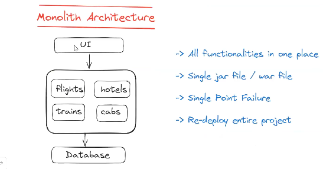


__<mark>MicroServices Architecture:__ All the functionalities will be implemented as a part of Separate Project .

__Advantages of using the MicroServices Architecture:__

  * __There won't be any single point of failure:__ If there is an issue in any of the functionality , rest of the functionalities can work .

  * __No Redeployment:__ If there is a fix in a particular functionality , we will deploy that functionality only .

    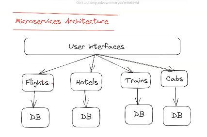

## Load-Balancer Setup in Monolithic Application :

* __Create EC2 VM-1 with below user data:__

```html
#! /bin/bash
sudo su
yum install httpd -y
cd /var/www/html
echo "<html><h1>Life Insurance Server - 1</h1></html>" > index.html
service httpd start
```
__NOTE:__ <mark>Enable the http protocol having port number 80 & SSH protocol having port number 22.
* __Create EC2 VM-2 with below user data:__

```html
#! /bin/bash

sudo su
yum install httpd -y
cd /var/www/html
echo "<html><h1>Life Insurance Server - 2</h1></html>" > index.html
service httpd start
```
__NOTE:__ <mark>Enable the http protocol having port number 80 & SSH protocol having port number 22.

* __Add these 2 instances to one "Target Group"__


* __Create Load Balancer with Target Group (ALB)__

  * __Scheme :__ Internet Facing

__NOTE:__  <mark>ALB runs on HTTP protocol with 80 port number (enable that port number in the security group)

* __Access Load Balancer DNS in browser__ (It will route the requests to our servers in round robin fashion)

    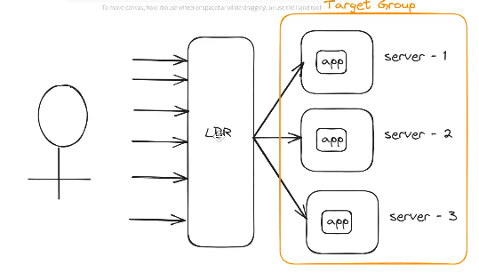

## Load Balancer Setup in Micro-Services Application :

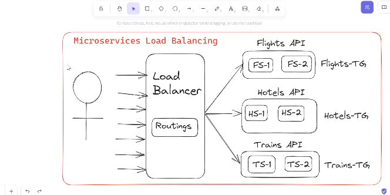

* __We can create Multiple Target Groups corresponding to each Microservice (whether its flight microservice , hotels microservice , trains microservice) and we can configure the path based routing in the Load Balancer to route our requests.__

  * http://makemytriplbr-460369493.ap-south-1.elb.amazonaws.com?type=flights __[For Re-Directing to the Flights API]__

  * http://makemytriplbr-460369493.ap-south-1.elb.amazonaws.com?type=trains __[For Re-Directing to the Trains API]__

## AutoScaling :

* Increasing /Decreasing the resources based on demand is called Auto-Scaling .

* Below are the advantages of using the AutoScaling.

  * __Fault Tolerance.__

  * __Availability.__

  * __Cost Management.__

