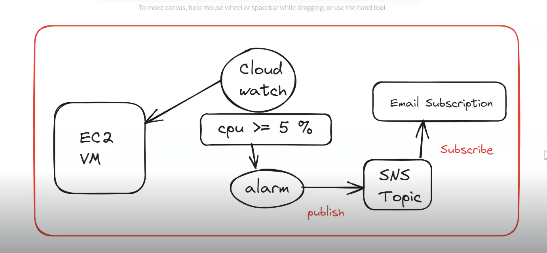

## AWS CloudWatch :

 * It is used for monitoring AWS Resources .

 * CloudWatch enables real-time monitoring of AWS resources such as __ec2 , EBS volumes, Elastic Load Balancing and RDS instances.__

 ### What is the use-case to use the CloudWatch ?

   * Create EC2 instance in aws cloud
   
   * Monitor that EC2 Instance 24/7
   
   * If Ec2 instance CPU utilization is above 90 % then trigger alarm.
   
   * When alarm got triggered send email notification to management.

__<mark>NOTE:__ We have to manually manage all the resources , if we dont use the CloudWatch Service.

### How to send Email notification in AWS ?

* In AWS we have SNS Service  to send notifications

	__<mark>SNS :__ Simple Notifcation Service

* <mark>__SNS__</mark>  works based on Pub and Sub Model

	__Pub => Publisher (will send msg to sns topic)__

	__Sub => Subscriber (will recieve msg from topic)__

   

### Cloud Watch & SNS - Lab Task :

__Step-1:__ Create SNS Topic with Email Notification (Standard Create)

* Topic Name : ashokit-sns-topic

__Step-2:__ Configure Email Subscription in SNS Topic (Confirm Subscription recieved in email)

__Step-3:__ Create EC2 Instance and Configure Cloud Watch Alaram To Monitor 

  * Select EC2 Instance -> Action -> Monitor and trouble Shoot -> Manager Cloud Watch Alarms -> Create cloud watch  Alarm
    
  *  Alarm Notification : Select SNS Topic which we have created, 
  Alarm Thresh Hold : Avg CPU Utiliation >= 5%

__Step-4:__ Connect to EC2 VM using ssh client and increase load on EC2 machine via below commands .

* $ sudo yum install stress -y
  
* $ sudo stress --cpu 8 -v --timeout 180s

__NOTE:__  Execute stress command 3 to 4 times...

__Step-5:__ Observe the behaviour of Cloud Watch / Alaram / SNS  (We should get Email Notification)

__NOTE:__ When Alarm got triggered, its status will be changed to 'In Alarm'