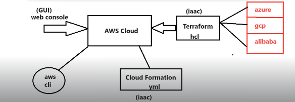

## AWS CLI (Command Line Interface):

AWS provides multiple ways to configure and manage infrastructure in the cloud.

* __AWS Management Web Console (browser)__

* __AWS CLI (Command Line Interface)__

* __Cloud Formation__

* __Terraform__

### What is AWS web console?

* It is a graphical user interface to connect with various AWS resources, their configuration, modification, etc. 

* It is simple to use and does not require knowledge of scripting.

### What is AWS Command Line Interface ?

* Usually, the script provides you with the flexibility to manage multiple AWS resources, infrastructures effectively.

### Configuration of AWS CLI

* Create AWS Account

* Login into AWS account & generate access key.

	* __Access Key :__ AKIATCKAMSJDE7Y

	* __Secret Key :__ 2kAO0/xcMycCzWqBhqCTLSkIIq

__<mark>NOTE:  Not recommended to create the Access Key & Secret Key for the root account . Instead of that we should create the IAM user.__</mark>

* Download and Install AWS CLI s/w	

	* __For windows : https://awscli.amazonaws.com/AWSCLIV2.msi__

* Once Installation completed then execute below commands in command prompt.

  * __$ aws --version__ 
  * __$ aws configure__

__NOTE:__  AWS configure command will ask for access key, secret access key, region and output format __(json , table or text)__

### Working with AWS S3 Service using AWS CLI:

* List down all buckets available

  * __$ aws s3 ls__

* Create bucket in s3

  * __$ aws s3 mb s3://ashokit097978__

* Copy file into bucket

   * __$ aws s3 cp test.txt s3://ashokit097978/test.txt__

* Remove file from bucket

  * __$ aws s3 rm s3://ashokit097978/test.txt__

* Remove bucket

   * __$ aws s3 rb s3://ashokit097978__

__<mark>NOTE:__ __In real world , we use terraform scripts to configure and manage infrastructure in the cloud.__

