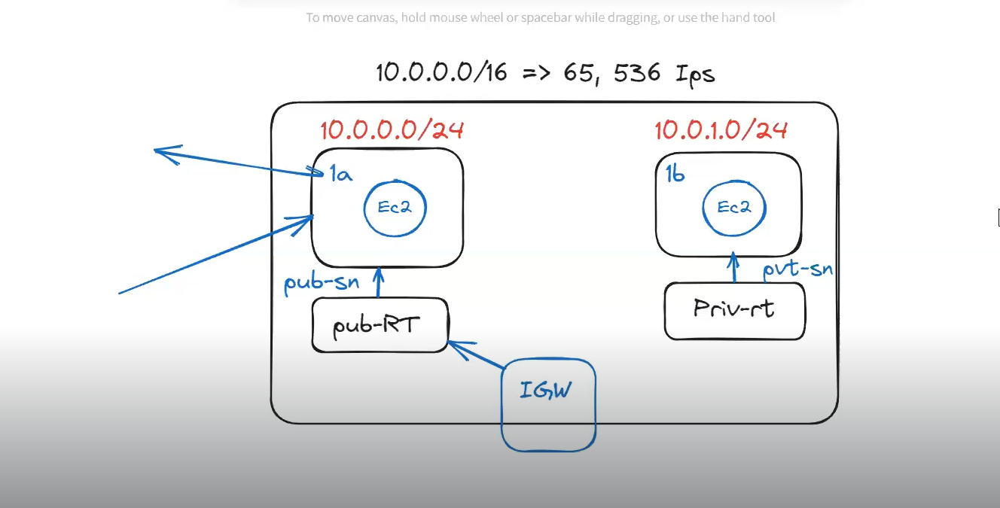
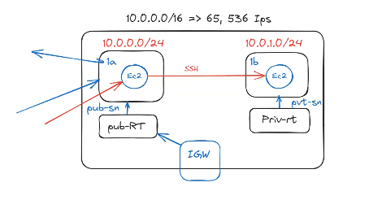
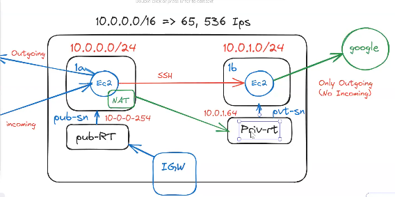
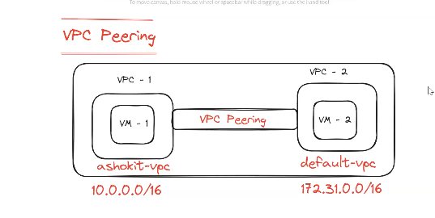
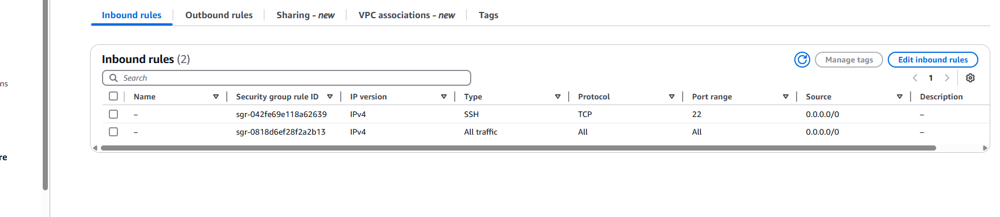

## AWS VPC (Virtual Private Cloud) :

* VPC stands for Virtual Private Cloud in the AWS.

* It is a virtual network environment provided by cloud computing platforms like Amazon Web Services (AWS), Google Cloud Platform (GCP), and Microsoft Azure.

* VPC allows users to create and manage their own isolated virtual networks within the cloud.

* VPC provides a flexible and secure network environment that enables users to build and manage their cloud-based applications and infrastructure with greater control and customization.

### What is a Subnet ?

* In VPC , AWS provides 65000+ IP addresses , those addresses when we divide into small networks that is called __Subnet (Sub Network)__

* In one VPC , we can create multiple Subnets.

  * __Public Subnet:__ A subnet <mark>__with Internet Gateway__</mark> is called Public Subnet. The Resources in the public Subnet we can access outside , [incoming/outgoing traffic is allowed for the Public Subnet]

  * __Private Subnet:__ A subnet <mark> __without Intenet Gateway__</mark> is called as Private Subnet. No Incoming/Outgoing traffic is allowed in the case of Private Subnet .

### Types of Ip's :

  * <mark>__IPV4:__</mark>

     * IPv4 addresses are 32-bit numeric addresses written in four sets of numbers separated by periods __(e.g : 192.168.0.1)__

     * It is the most widely used IP version and supports approximately 4.3 billion unique addresses

     * However, due to the increasing number of devices connected to the internet, IPv4 addresses are running out, leading to the adoption of IPv6.

 * <mark>__IPV6__</mark>

   * IPv6 addresses are 128-bit alphanumeric addresses written in eight sets of four hexadecimal digits separated by colons __(e.g., 2001:0db8:85a3:0000:0000:8a2e:0370:7334)__

   * IPv6 provides a significantly larger address space than IPv4, with approximately 340 undecillion unique addresses.

   * It was introduced to overcome the IPv4 address exhaustion issue and support the growing number of internet-connected devices.

### VPC Sizing :

 * The process of dividing IP Addresses into Subnets is called VPC Sizing .

 * Sizing will be calculated in the __power of 2.__

 * If we give range as /16 then we will get __65,536 IPs__
 
   * __10.0.0.1/16 = > 2 power (32-16) => 2 Power 16 => 65,536__

* We can start giving subnet ranges from /16 to /28

  <mark>__Recommended to use /24__</mark> 

	* __10.0.0.1/24 = > 2 power (32-24) => 2 Power 8 => 256__

__NOTE:__ With /24 we will get 256 IPs those are sufficient for our usecases in realtime.

### Q. Can we create two Subnets with the same CIDR ?

* No we cannot do it , because two subnets will same same have IP for the resources and the resources should not have the same IP (Each Resource should have a unique IP) 

### <mark>VPC LAB TASK :

* __Create VPC__ 

  * It will create one Route Table by default. Rename it as __ashokit-private-rt__
  
  * <MARK>__Use VPC CIDR as : 10.0.0.0/16__</MARK>

* __Create 2 Subnets  (Public and Private Subnets)__

	__public Subnet CIDR :__ <mark>10.0.0.0/24

	__private Subnet CIDR :__ <mark>10.0.1.0/24 

__NOTE:__ CIDR for both Public Subnet & Private Subnet should be different , otherwise it will result in __IP Collisions.__

* __Create Internet Gateway and Attach to our VPC__ : <mark>__It is the main gate for the VPC__</mark> 

* Create one new Route Table name it as __ashokit-public-rt__

* __Peform Subnet Association with Route Tables.__ 

   * __public-rt => public-sn__
   * __private-rt => private-sn__

* __Attach IGW to Public Route Table so that that subnet will become public-subnet.__

* __Create One EC2 VM in public subnet and another EC2 vm in private subnet.__

* __Test connectivity of both vms using MobaXterm.__

   

__NOTE:__  We should be able to connect with EC2 VM created in public-sn __(Both Incoming and Outgoing requests would be allowed , you can ping google.com for outgoing requests)__ and we shouldn't be able to connect with EC2 vm created in private-subnet.

### Q. How we can create the file in the private subnet machine (Access is not allowed from Outside?

* We cannot connect from outside to this private subnet and hence file creation is not possible , but we have the below way :

   * <mark>__From outside we can connect to public subnet machine and from public subnet machine we can connect to private subnet machine and within same VPC one subnet resource can access another subnet resource because local traffic is allowed within VPC.__</mark>

     

   * __Connect with 'private-ec2' from 'public-ec2' using 'ssh' connection__
   
      __NOTE:__ As both Ec2 instances are available under same VPC, we should be able to access one machine from another machine.
      
     * Upload pem file into public-ec2 machine (in mobaxterm we have upload option)
     
     * Execute  below command to provide permission to access pem file

		* $ __chmod 400 `<pem-file-name>`__

     * Execute below command to make ssh connection from public-ec2 to private-ec2

		* $ __ssh -i "pem-file-name"  ec2-user@private-ec2-vm-private-ip__
        
        * <MARK>__ssh -i "ashokitnewkey.pem" ec2-user@65.2.73.111__<MARK>

     __NOTE:__ It should establish connection (this is internal connection)			

__NOTE :__  Try to ping google.com from private ec2 (it should not allow because igw is not available)

### What is NAT Gateway ??

* It is Commercial, the main purpose of the NAT Gateway is to allow outgoing traffic from the Subnet machine , No Incoming traffic would be allowed.

* __Internet Gateway:__ It is the main gate in the VPC , It is used to allow both incoming and outgoing traffic in the Subnet machine .

   
* Below are the steps to create the NAT Gateway:

  * __Create NAT gateway in public subnet__
    
    * If we create the NAT Gateway in the public subnet , then only it will allow you to access the outgoing traffic from the private subnet . If we create the NAT Gateway also in the Private Subnet , there is no use , because private subnet has no Internet Connection , NAT Gateway requires the Internet Connection to allow your resources to connect to the Internet.

  * __Add NAT gateway in 'private-subnet-routute-table'__

  * __After NAT Gateway, we should be able to ping google from 'private-ec2' also__

## What is VPC Peering ??

* By Default, VPC's are Isolated , the resources available in the VPC cant be access outside , If we want that then we need to establish the peering between the VPC's.

* We can establish the peering between the VPC available in the same or another account , but acceptance is required.

    

* Below are the steps to establish the peering:

  * On the left navigation panel under __VPC -> Peering Connections.__
  
    * VPC (Requester) = ashokit-vpc

    * VPC (Accepter) = default-vpc

  * Now you would see the status Pending Acceptance which means, Requestor has sent a request to the peer now target VPC needs to accept the request.

  * Go to VPC Peering -> Click on Actions -> Accept Request
  
  * __Now we need to make entries in Route Tables.__

  * Now navigate to Route Tables, in default-vpc RT(Route Table) -> __Edit routes__

    *   <mark>__Default VPC Route Table should have 3 routes__</mark>

       __(Local + all traffic with IGW + ashokit-vpc IP Range)__

       * 172.31.0.0/16 - local
       * 0.0.0.0/0 - Internet-gateway
       * 10.0.0.0/16 - vpc peering  (We need to add this)

    *  <mark>__Custom VPC Route Table should have 3 routes.__</mark>

    __(Local + All traffic with IGW + default-vpc IP Range)__

       * 10.0.0.0/16 - local
       * 0.0.0.0/0 - Internet-gateway
       * 172.31.0.0/16 - vpc  (We need to add this)

* Edit Security Group of default-vpc and ashokit-vpc to allow traffic from each other
 
  * __SSH - TCP__

  * __All Traffic - All__

  

## What is the difference between NACL and Security Groups ?

__Security Groups :__

 * Security Group acts as a Firewall to secure our resources

 * Security Group contains Inbound Rules & Outbound Rules
 
   * inbound rules ---> incoming traffic
   * outbound rules ---> outgoing traffic
	
* In One security group we can add 50 Rules

* Security Group supports only Allow rules (by default all rules are denied)

* We can't configure deny rule in security group

	__Ex : 172.32.31.90 ----> don't accept request from this IP (we can't do this in SG)__

* Security Groups are applicable at the resource level (manually we have to attach SG to resource)

* Multiple Security Groups can be attached to single instance & one instance can have 5 security groups

* Security Groups are statefull 
(Any changes applied to incoming rules then those changes will be applicable for Outgoing Rules also)

* In Security Group we can configure Rule destination as CIDR and IP

* Security Group acts as First Level of defense for Outgoing traffic

__NACL:__

* NACL stands for Network Access Control List

* NACL acts as a firewall for our Subnets in VPC

* NACL applicable at the subnet level

* NACL rules are applicable for all the resources which are part of that Subnet

* NACL rules are stateless 
(Any changes applied to incoming rules will not be applicable for outgoing rules, we need to do that manually)

* In NACL we can configure both Allow & Deny rules

  __Ex: We can block particual IP address (192.168.2.4) to connect with EC2 instance__

* One subnet can have only one NACL

__NOTE:__ One NACL can be added to multiple subnets

* NACL supports rule destination as only CIDR

* NACL acts as first level of Defense for Incoming Traffic 

