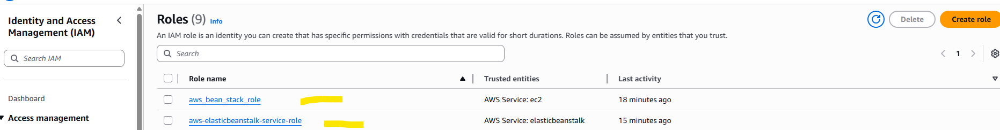

## __AWS Elastic Beanstalk__ :

### What is Dynamic Website Deployment Process ?

* Create Network (VPC)

* Create Security Groups

* Enable Inbound Rules to allow the traffic

* Create EC2 Instances __(Virtual servers)__

* Install Required Softwares to run the code 

	* __Ex : Java, Tomcat, IIS__

* Create Load Balancer

* Deploy application to Server

__<mark>NOTE:__ When we use __"AWS Elastic Bean stack"__  service then first 6 steps will be taken by Elastic Beanstack. We are responsible for only application deployment.

### What is Elastic Beanstack ?

* It is End to end web application management service.

* It provides platform as a service __(PaaS).__

* AWS will provide ready made platform to run our application when we go for Beanstack.

__<mark>NOTE:__   Upload your code and run your application, aws will take care of infrastructure and platform to run your application.

### Elastic Beanstack Pricing Model :

* There is no additional charge for Elastic Beanstalk. 

* We need to pay for the resources which are created by bean stack.

  __Ex: S3 bucket, EC2 Vm, LBR.....__

__<mark>NOTE:__ Whenever we deploy the project by using beanstack , in the background beanstalk will create __s3 buckets , ec2 instances , load balancer etc__ and for those resources , charges are applicable. We can check also the machines would be created , load balancers would be created etc.

### Lab Task on Elastic Beanstack:

* Step-1: Create IAM Role with below 3 policies

  * __AWSElasticBeanstalkMulticontainerDocker__
  * __AWSElasticBeanstalkWebTier__
  * __AWSElasticBeanstalkWorkerTier__

  * <mark>__Ex : Role Name :__</mark> aws_bean_stack_role	

__NOTE:__ <mark>__For ec2 instances , some permissions are required to do the application deployment , so for giving the permissions to ec2 instances , we create the IAM role .__
* 

* Step-2: Create Application using Beanstack

* Step-3: Create Environment for the application by choosing required Runtime.

	* __Ex: Java or Python or Dot Net__

__NOTE:__ Once environment is created it will generate DNS to access our application.

### Uploading Java SpringBoot rest App 

* Git Repo To download jar file : https://github.com/ashokitschool/Jars

* Take jar file of java springboot rest app

* Go to Elastic Beanstack environment and upload your jar file and give version number for your application

   * Ex: v1.0

__NOTE:__ <mark> __In Beanstalk , we can maintain multiple versions of our application & we can deploy particular version of the JAR file based on demand.__

* Go To enviornment Properties and set SERVER_PORT as 5000

    * __SERVER_PORT = 5000__	
    * __Select Environment__
	* __Go to Configuration__
	* __Edit "Updates, monitoring, and logging" option__
	* __Set Environment Property and apply__	

* After environment got re-started, we can access our application by using DNS url.	

__NOTE:__  This DNS url we can map to domain name using Route 53 service.

