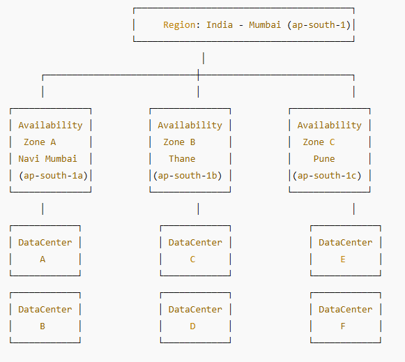
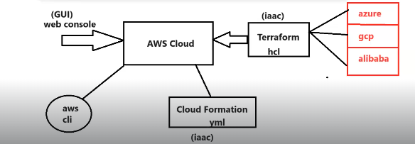

## Cloud Service Models :

* __IAAS (Infrastructure as a Service)__ :

  * Provider will give you the machines and network , we need to configure everything in order to run our business . 

* __PAAS (Platform as a Service)__:

  * Provider will give you the readymade platform , you just focus on your application development and you can execute your application on the platform given by the provider .

* __SAAS (Software as a Service)__:

  * Provider will give the readymade application to run our business (EX: Zoom , Google Drive etc)

## What is AWS Cloud  ? 

* Since 2006 ,  AWS is providing IT resources over internet on __Pay as you model.__

* AWS is having global infrastructure ,  190+ countries across the globe are using the AWS Services .

## Region's & Availability Zones & Infrastucture Creation :

  * <mark>__Region : Geographical Location (32 regions)__

  * <mark>__Availability Zone's : Data Center (Server Room) -> 102 Az's__

     

  * Below are the different ways to create the infrastructure in the Cloud.

    * __Web Console (GUI)__
    * __AWS CLI__
    * __Cloud Formation (YML/JSON)__
    *  __Terraform (Supports Multiple Clouds)__

        

