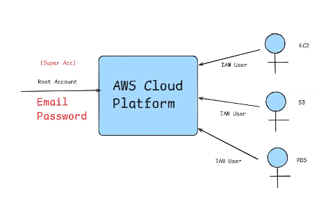
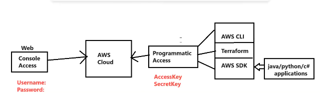
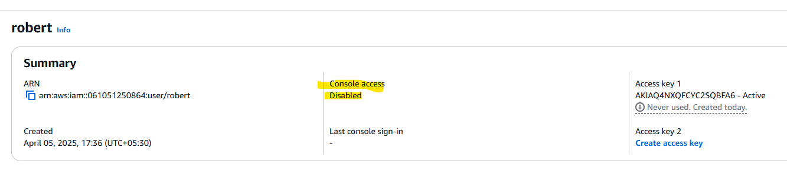
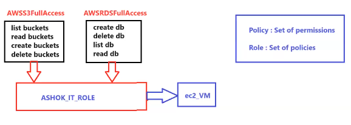

## AWS IAM (Identity & Access Management):
* There are two types of accounts that we can see in AWS.

  * __Root Account:__ : This account will have access for everything in AWS.

  * __IAM Account:__ : We can manage the permissions in this account.

* We should not use Root Account for our daily activities. (This Account is only used for the Billing Activities)

* For daily activities , we are going to use __IAM Accounts.__

* Every team member will get IAM Account to perform daily activities .

* In IAM Account we can give permissions to access particular services in AWS Cloud.

__NOTE:__ IAM is completely free service in AWS .

__MultiFactor Authentication:__

* It is used to provide additional security to the root account.

* Enable MFA for root account using Google Authenticator app.

* After enabling MFA, logout and login into root account and check behaviour.

__IAM Users:__

  * Create IAM User-Account and attach policies (RDSFullAcces, S3FullAccess)

  * Login into IAM User-Account and from that user you wont be able to access EC2 service (because of no permission)

__IAM User Group:__

* Create the User Group 

* Attach Policies to the Group .

* Add Users to the Group.

__NOTE:__ Its the responsibility of the Cloud Engineer to provide which user has the capability to access the AWS Cloud via __Console Access OR AccessKey -SecretKey.__

<mark>__Permission at the Group Level is always recommended.__

__NOTE:__ We can create our own policies also in the AWS Cloud. (<mark>__Policy= Set of Permissions__</mark>)

* There can be two types of policies in the AWS Account :

  * __AWS Managed Policy__
  * __Customer Managed Policy__

__IAM ROLE:__

* IAM role is nothing, but set of Policies(<mark>__Role= Set of Policies__)

  

<mark>__Policies will be assigned to Users , and roles will be assigned to Services.__

__<mark>NOTE:__ When we work in any organization as a developer then we get the IAM user account with limited access to services , we have to check which accesses are given to us (__Console access__ OR __Programmatic access__ OR __both__)