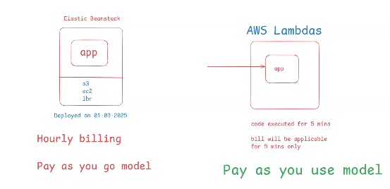
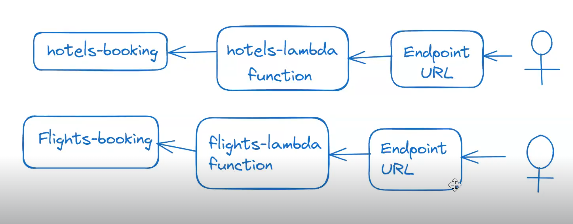

## AWS Lambdas :

* AWS lambdas are used to achieve serverless computing.

* Serverless computing means run the application without thinking about servers.

* AWS will take care of servers required to run our application.

* The main advantage of serverless computing is it works based on <mark>__'Pay as you use' model.__

* If your application code is executed then only bill be generated. If nobody accessing your application then no bill.

    > __code executed for only 5 mins : bill will generate only for 5 min__

    

### AWS Elastic Beanstalk VS AWS Lambda's :

  * when we go with Beanstalk , 24*7 infrastructure would be in the running state , but in Lambdas's whenever the request comes then only the container would be created.

  * We should go with Lambda's when there is a limited number of functionalities __Small Scale Application__ , but in case of __Large Scale Application__ where we have many functionalities , we should use Beanstalk.

  *  Beanstalk Service can be used only for Web Application Deployment __(JAR/WAR)__ , but in Lambda's we can do any type of Deployment.

### Running Java Code with AWS Lambda :

* Create Lambda Function with 'java 21' runtime

	- __Enable Functional URL__

	- __Auth Type as None (Public Access)__

    

__NOTE:__  Once lambda function got created we can see URL to access that function.

* Access Lambda function using its URL. It will display default msg.

  * __Git Repo For JAR download : https://github.com/ashokitschool/Jars__

* Upload jar file in 'Code Source'

* Configure handler in Runtime

    * __Handler Syntax :__ pkg.className :: methodName
    
      * __Class Name :__ in.ashokit.LambdaHandler
	  * __Method Name :__ handleRequest()
      
      Ex: in.ashokit.LambdaHandler::handleRequest

* Access Lambda function using its URL and see the response.

### Approaches for Static Website Deployment :

* __<mark>Approach-1 :__  S3 static website hosting

* __<mark>Approach-2 :__ Create EC2 VM + Install HTTPD Server + Run Static website

### Approaches for Dynamic Website Deployment :

* __<mark>Approach-1 :__ Take EC2 VM Then install required softwares and run your application.

* __<mark>Approach-2 :__ Use Elastic Beanstack __(PaaS)__

* __<mark>Approach-3 :__ Use Lambdas __(PaaS + Serverless Computing)__

